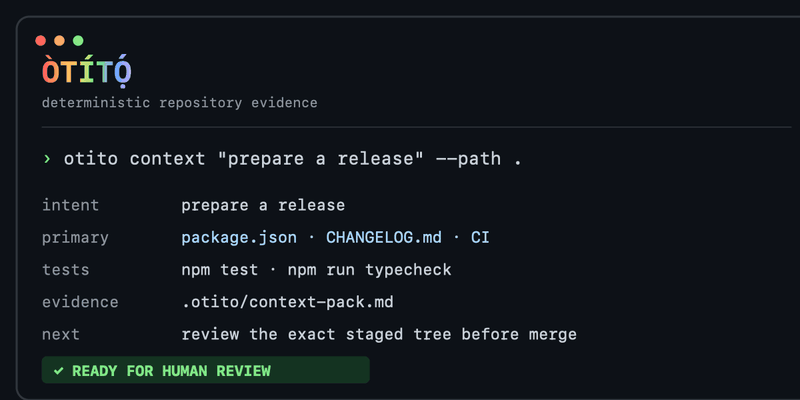
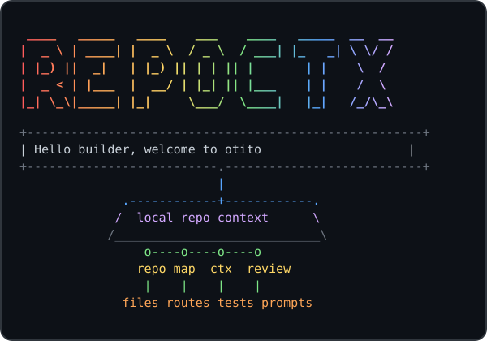

# Òtítọ́

**Local-first code context for agents and reviewers: what does this change actually touch?**

[](https://github.com/BASHBOP/otito/actions/workflows/otito-ci.yml) [](https://www.npmjs.com/package/@bashbop/otito) [](LICENSE) [](https://nodejs.org/)





```text
  ___ _____ ___ _____ ___
 / _ \_   _|_ _|_   _/ _ \
| | | || |  | |  | || | | |
| |_| || |  | |  | || |_| |
 \___/ |_| |___| |_| \___/
```

An agent's output is bounded by two things: the **model** and the **harness** around it. The harness includes the prompts, the context it's given, the codebase it works in, and the gates it must pass before code merges. You don't control the model. You control the harness, and a tighter harness lets a cheaper model do the same work with fewer wasted tokens.

**Òtítọ́** is that harness layer. It is local-first, deterministic, and model-agnostic: it discovers repositories, builds local indexes, generates task-aware context before an agent edits, scores how much a change actually touches, and gates merge readiness. It works the same way every time, with no server, no account, and no code leaving the machine. Because it depends on software fundamentals rather than any one model, the harness you build today keeps working as models change underneath it.

It does not try to replace `opensrc`, `code-structure`, Daytona, or Harnss. It gives developers and coding agents a single CLI that can:

Deterministic merge gates are the differentiated core. This is the human-in-the-loop checkpoint that a model cannot grade for itself:

- score merge readiness for local changes and pull requests with one `review_gate` tool (`gate` on the CLI)
- resolve CODEOWNERS to required reviewers and surface owner-decision warnings
- check branch-protection expectations and required checks before merge
- generate actionable PR review context from git diffs and optional GitHub comments

Local-first context feeds the gates:

- inspect a repository
- discover and index local repositories
- maintain a local catalog and search across it
- generate task-aware context packets before an agent plans or edits
- generate AST-backed JSON-first code maps for agents
- generate a setup/validation/runtime harness for a repo
- produce Markdown or JSON reports
- estimate context-token size for generated artifacts
- run an MCP server for agent hosts with a persisted per-user index cache that never dirties an inspected repository
- expose simple agent-friendly tool metadata
- check tool availability
- generate TypeScript structure HTML through `code-structure`
- search dependency source through `opensrc`

## Documentation

The published MkDocs site is a practical discovery and delivery guide:

- [Home](docs/index.md)
- [Executive Summary](docs/EXECUTIVE-SUMMARY.md)
- [Context Foundation](docs/01-context-foundation/README.md)
- [MCP and Agent Workflows](docs/02-mcp-agent-workflows/README.md)
- [Contributor Governance](docs/03-contributor-governance/README.md)
- [Release Readiness](docs/04-release-readiness/README.md)
- [Trust-Layer Demo](docs/05-trust-layer-demo/README.md)
- [Builder-Founder Operating Loop](docs/06-builder-founder-operating-loop/README.md)
- [Harness Thesis & Agent Experience](docs/07-harness-thesis/README.md)
- [Tutorials Integration (Codespaces)](docs/08-tutorials-integration/README.md)
- [Convergence Thesis & Score](docs/09-convergence-thesis/README.md)
- [Usage & Performance Dashboard](docs/10-usage-dashboard/README.md)
- [Glossary](docs/GLOSSARY.md)

Read it at:

```text
https://bashbop.github.io/otito/
```

## Quick Start

Code maps use the TypeScript compiler for JS/TS and dedicated language extractors for Go, C#, Python, Java, Ruby, and Rust (see `src/lib/code-map/ast-languages.js`). Optional external tools are only needed for dependency-source lookup and HTML structure reports.

Install the published package from npm:

```bash
npm install -g @bashbop/otito
otito doctor
otito index ~/projects --discover
otito context "add a new MCP tool" --path .
```

You can also run a command without a global install:

```bash
npx -y @bashbop/otito doctor
```

For source development:

```bash
git clone https://github.com/BASHBOP/otito.git
cd otito
npm ci
npm run ci
node src/cli.js doctor
```

The current release is available through [npm](https://www.npmjs.com/package/@bashbop/otito), [GitHub Releases](https://github.com/BASHBOP/otito/releases), and the MCP Registry as `io.github.BASHBOP/otito`.

```bash
otito repo . --json
otito discover ~/projects --depth 2 --json
otito index ~/projects --discover
otito catalog
otito search "events controller"
otito context "add a new MCP tool" --path .
otito impact . "add a new MCP tool" --top 12
otito ax . "add a new MCP tool"
otito map . --json
otito harness . --out .otito/harness.md
otito pr . --base origin/main --out .otito/pr-review.md
otito review . --request "add a new MCP tool" --base origin/main
otito gate . --staged --base origin/main
otito mcp
otito report . --out .otito/report.md
otito workspace /path/to/web /path/to/api --out .otito/workspace.md
```

Optional external tools:

```bash
npm install -g opensrc code-structure
```

Then:

```bash
otito deps zod --query parse
otito structure . --out .otito/structure.html
```

## Usage Examples

| Goal | Command | Output |
| --- | --- | --- |
| Inspect one repo | `otito repo . --json` | Repo facts, scripts, languages, entrypoints, and git state |
| Build a code map | `otito map . --json` | Source files, domains, imports, exports, symbols, and routes |
| Prepare task context | `otito context "add a new MCP tool" --path .` | Primary files, related files, tests, patterns, and validation commands |
| Generate an agent harness | `otito harness . --out .otito/harness.md` | Setup, validation, runtime, and context commands |
| Review local changes | `otito pr . --base origin/main --out .otito/pr-review.md` | Changed files, risk prompts, review targets, and test hints |
| Index local projects | `otito index ~/projects --discover` | External per-user indexes plus a local catalog |
| Search indexed repos | `otito search "events controller"` | Ranked matches across paths, domains, routes, imports, exports, and symbols |
| Run the MCP server | `otito mcp` | Stdio MCP server exposing otito tools |
| Track usage & performance | `otito dashboard` | Self-contained HTML from an opt-in local usage log (off by default) |

For Claude Desktop, VS Code, Cursor, and generic stdio client snippets, see [MCP and Agent Workflows](docs/02-mcp-agent-workflows/README.md).

## otito vs alternatives

| Approach | Strengths | Where otito differs |
| --- | --- | --- |
| Sourcegraph / Cody context | Powerful hosted code search and embedding-based context across an org | otito is local-first and deterministic: no server, no account, no code leaves the machine, and the same query always yields the same packet |
| Hand-written `CLAUDE.md` / rules files | Curated, intent-rich guidance | Hand-written context goes stale; otito regenerates context from the actual code (symbols, imports, routes, tests) on every run and complements a short `CLAUDE.md` |
| `grep` / `ripgrep` | Fast, universal text matching | otito ranks whole files by task intent across paths, symbols, exports, and tests, then adds patterns and validation commands. The result is a context packet, not a list of matching lines |

## Quality Gates

Use the full gate before opening a pull request or publishing a release:

```bash
npm run ci
```

The gate runs:

- `npm run format:check`
- `npm run lint`
- `npm run typecheck`
- `npm run version:check`
- `npm test`
- `npm run test:coverage`
- `npm run eval:accuracy`
- `npm run eval:harness`
- `npm run audit`
- `npm run smoke`

Coverage currently gates source files at 70% lines, 60% branches, and 75% functions. Generated artifacts under `.otito/` are ignored by git, linting, and formatting; keep durable reports there instead of committing them.

The v1.1.0 harness execution evaluation runs only vetted install, test, typecheck, and build commands against committed fixtures. It disables install lifecycle scripts, applies timeouts, and never executes inferred commands from a customer repository.

otito follows Semantic Versioning. Pull requests should identify whether they are no-version-impact, patch, minor, or major changes; maintainers apply the final package version during release.

For longer trust-layer work, use the [Builder-Founder Operating Loop](docs/06-builder-founder-operating-loop/README.md) to keep every session tied to context, focused changes, visible gates, human decisions, and durable evidence.

## Contributing

Contributions are welcome. Start with [CONTRIBUTING.md](CONTRIBUTING.md), open an issue or draft PR for substantial changes, and run `npm run ci` before requesting review.

All code changes must be reviewed by a maintainer/code owner before merge. The protected `main` branch requires maintainer approval, passing quality gates, and resolved PR conversations.

## Common Workflows

Agent repo harness:

```bash
otito harness . --out .otito/harness.md
otito map . --json
```

Local discovery, indexing, catalog, and search:

```bash
otito discover ~/projects --depth 2
otito index ~/projects --discover
otito catalog
otito search "submit rsvp"
```

Task-aware agent context:

```bash
otito context "add a new MCP tool" --path . --json
otito context "add a new MCP tool" --path . --out .otito/context-pack.md
```

PR review harness:

```bash
otito pr . --base origin/main --out .otito/pr-review.md
otito pr . --number 123 --comment
```

Merge gate (`gate` is the canonical v2 command; `pass` / `pass-pr` remain as legacy aliases):

```bash
otito gate . --base origin/main          # local gate (no GitHub)
otito gate . --staged --base origin/main # staged-path evidence, suitable for pre-commit hooks
otito gate . --base origin/main --request "update the greeting" --min-convergence 80
otito converge "update the greeting" --path . --base HEAD --staged --json # exact change-subject receipt
otito gate --pr 123 --path .             # GitHub PR gate via gh
```

In staged mode, changed-path, risk, secret and convergence evidence use the exact Git index tree. Exact-subject source analysis streams raw Git blobs and fails closed above 5,000 source files or 64 MiB. Release, validation-command and optional analyzer checks still inspect the working tree and are reported outside the convergence receipt.

Multi-repo product context:

```bash
otito workspace ../web ../api --out .otito/workspace.md
```

GitHub Actions bootstrap:

```bash
otito init /path/to/target-repo
```

Local Ollama review:

```bash
otito harness . --out .otito/harness.md

{
  echo "Use this repo harness to explain the project and suggest the next best engineering task."
  echo
  cat .otito/harness.md
} | ollama run qwen3:8b --think false --hidethinking --nowordwrap
```

Local Ollama PR review:

```bash
otito pr . --base origin/main --out .otito/pr-review.md

{
  echo "Review this PR context. Focus on bugs, missing tests, and risky changes."
  echo
  cat .otito/pr-review.md
} | ollama run qwen3:8b --think false --hidethinking --nowordwrap
```

## Commands

### `doctor`

Checks the local runtime and optional external tools.

```bash
otito doctor --json
```

### `install` / `i`

Prints install commands and current binary status. From a local checkout, `--global` runs `npm install -g .`; `--link` runs `npm link`.

```bash
otito install
otito i
otito install --global
otito install --json
```

After installation, use `otito` as the command.

### `repo <path>`

Inspects repo shape: files, package metadata, languages, package managers, scripts, likely entrypoints, git metadata, and ignored-heavy directories.

```bash
otito repo . --json
```

Git repositories are scanned through `git ls-files --cached --others --exclude-standard` so ignored files do not pollute harness context. Plain directories fall back to the built-in walker.

### `discover <root...>`

Discovers repository roots under one or more local directories without indexing them.

```bash
otito discover ~/projects --depth 2
otito discover . --json
```

Discovery stops at directories with common repo markers such as `package.json`, `.git`, `pyproject.toml`, `go.mod`, `Cargo.toml`, and `Package.swift`.

### `index <repo...>`

Generates per-user external indexes and adds repositories to the local catalog. The inspected repositories are not modified.

```bash
otito index .
otito index ~/projects --discover
otito index . --catalog /tmp/otito-catalog.json --json
```

The default catalog path is `~/.otito/catalog.json`. Set `OTITO_CATALOG` or pass `--catalog` to use a different file.

### `catalog`

Lists repositories currently indexed in the local catalog.

```bash
otito catalog
otito catalog --json
```

### `search <query>`

Searches indexed local repositories by path, domain, kind, route, controller path, imports, exports, and symbols.

```bash
otito search "events controller"
otito search "submit rsvp" --limit 10
otito search "api client" --offline --json
```

By default, search refreshes repo indexes when fingerprints change. Use `--offline` to read only the stored external indexes.

### `context <query>`

Generates a local context-engine packet for a task. The packet includes inferred intent, primary files, related files, matching tests, implementation patterns, validation commands, conflicts, source evidence, and token estimates.

```bash
otito context "add a new MCP tool" --path . --json
otito context "add a new CLI command" --path . --out .otito/context-pack.md
```

Use this before handing work to a coding agent. It is deterministic and local-first: it relies on repo indexes, code maps, import relationships, tests, and harness commands rather than an external model.

### `harness <path>`

Generates a repo harness with setup commands, validation scripts, runtime scripts, context commands, focus areas, and estimated context-token usage.

```bash
otito harness . --out .otito/harness.md
otito harness . --json
```

Use this as the first artifact an agent or CI workflow reads before touching code.

### `init <path>`

Scaffolds otito into another repository.

```bash
otito init /path/to/target-repo
otito init /path/to/target-repo --force
otito init /path/to/target-repo --no-workflow
otito init /path/to/target-repo --tool-repo BASHBOP/otito --tool-ref main
```

Generated files:

- `.otito/README.md`
- `.github/workflows/otito-ci.yml`

The generated workflow runs on pull requests and commit pushes. Pull request runs generate the report, upload an artifact, and create or update a sticky PR comment. Push runs generate and upload the report artifact without commenting.

### `structure <path>`

Runs `code-structure` against TypeScript files.

```bash
otito structure . --pattern "app/**/*.tsx" --out .otito/structure.html
```

If `code-structure` is missing, the command returns an install hint instead of failing mysteriously. If it is not installed globally but `npx` is available, otito can run it through `npx --yes code-structure`.

### `deps <package>`

Uses `opensrc path <package>` to resolve dependency source and optionally search it.

```bash
otito deps zod --query parse --limit 20
```

### `report <path>`

Generates a shareable developer report.

```bash
otito report .
otito report . --out .otito/report.md
otito report . --json
```

The default output is formatted for terminal reading and ends with estimated token usage. Use `--out` for the Markdown artifact or `--json` for structured data.

### `workspace <repo...>`

Generates one product-level report across related repos.

```bash
otito workspace /path/to/web /path/to/api --out .otito/workspace.md
otito workspace /path/to/web /path/to/api --json
```

### `pr <path>`

Generates a PR review context pack from local git diff metadata, code-map classification, review targets, targeted review prompts, risk flags, suggested verification commands, estimated tokens, and optional GitHub PR comments.

```bash
otito pr . --base origin/main --out .otito/pr-review.md
otito pr . --number 123 --comment
```

Useful flags:

- `--base <ref>`: compare from a specific base ref. Defaults to PR base, upstream, `origin/main`, or `main`.
- `--head <ref>`: compare to a specific head ref. Defaults to `HEAD`.
- `--number <n>`: enrich with `gh pr view` metadata and review comments.
- `--github`: ask `gh` to infer the PR from the current branch.
- `--comment`: create or update a sticky GitHub PR comment using `gh`.

### GitHub Actions

This repo includes `.github/workflows/otito-ci.yml`. The workflow installs dependencies, runs `npm run ci`, then generates PR or push review context as an uploaded artifact. Use `otito init /path/to/target-repo` to scaffold an Otito review workflow into another repository.

### `mcp`

Starts a stdio MCP server exposing otito as agent-callable tools. MCP repo-map lookups use an external per-user cache with a file fingerprint, refresh when files change, and never write into the inspected repository.

The server is published in the MCP Registry as `io.github.BASHBOP/otito`.

```bash
otito mcp
```

When wiring it into an MCP host (Claude Desktop, Claude Code, Codex CLI, Cursor, etc.):

```json
{
  "mcpServers": {
    "otito": {
      "command": "npx",
      "args": ["-y", "@bashbop/otito", "mcp"]
    }
  }
}
```

If you prefer a globally installed binary:

```json
{
  "mcpServers": {
    "otito": {
      "command": "otito",
      "args": ["mcp"]
    }
  }
}
```

Ollama can provide the local model, but it does not call MCP tools by itself. To use otito through MCP with a local model, use an MCP-capable agent client that supports Ollama as the model provider and configure the `otito` server above.

Òtítọ́ exposes **13** MCP tools for repository inspection, context, impact, review, and merge evidence.

| Tool                | Purpose                                                                            |
| ------------------- | ---------------------------------------------------------------------------------- |
| `repo_inspect`      | Inspect repository shape, scripts, package managers, entrypoints, and git state    |
| `repo_map`          | Compact JSON code map, filterable by `domain`, `kind`, and `route`                 |
| `repo_index`        | Generate external indexes + catalog entries; `dryRun:true` discovers read-only     |
| `repo_search`       | Search the catalog; omit `query` to return the catalog listing                     |
| `context_pack`      | Build a task-aware context packet                                                  |
| `change_impact`     | Rank files most likely to own a plain-English change request                       |
| `agent_experience`  | Score Agent Experience (AX 0–100): changeability, containment, guardrails, clarity |
| `convergence_score` | Score intent vs. execution (0–100) with an exact change-subject receipt            |
| `review_context`    | Diff/comment review context (no verdict)                                           |
| `review_gate`       | PASS/WARN/FAIL merge gate: local without `pr`, GitHub PR gate with `pr`            |
| `review_verdict`    | Composite verdict: impact + review_context + review_gate                           |
| `workspace_report`  | Product-level report across multiple repos                                         |
| `repo_harness`      | Setup, validation, runtime, and context commands for an agent or CI harness        |

### `matrix`

Prints the tool evaluation matrix for Greploop, `code-structure`, `opensrc`, Daytona, and Harnss.

### `agent-tools`

Prints JSON or Markdown metadata derived from the canonical MCP tool catalog, keeping CLI and MCP integrations aligned.

## Strategy

Wrap first. Measure pain. Build only the missing pieces.

This keeps the project useful quickly while leaving room to replace weak adapters with owned implementations later.

---

## Part of the toolchain

**otito** is one of four tools that form a deterministic trust layer for AI-assisted development. Each uses static analysis to answer a question people keep handing to an LLM.

- **otito** (this tool), for context: what does this change actually touch?
- [tieline](https://www.npmjs.com/package/@bashbop/tieline), for contracts: did the front end and back end quietly stop agreeing?
- [bouncer](https://www.npmjs.com/package/@bashbop/bouncer), for compliance: could you defend this to Ofcom?
- [aiglare](https://www.npmjs.com/package/@bashbop/aiglare), for governance: where can the model do something you can't undo?

More at [segunolumbe.com](https://segunolumbe.com). _static analysis, never the model._
