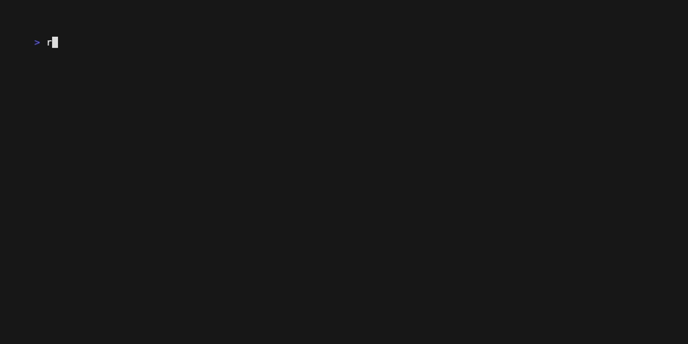
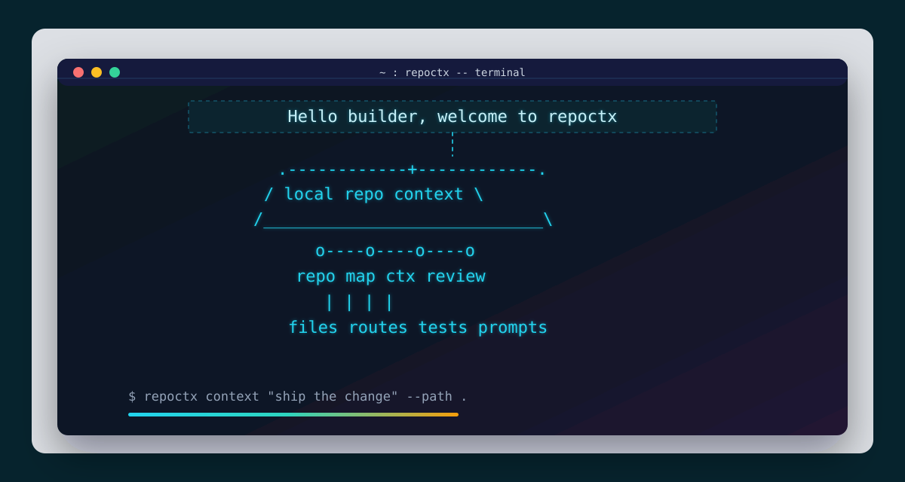

# repoctx

**Local-first code context for agents and reviewers — what does this change actually touch?**

[](https://www.npmjs.com/package/@nugehs/repoctx) [](https://github.com/nugehs/repoctx/actions/workflows/repoctx-ci.yml) [](LICENSE) [](https://www.npmjs.com/package/@nugehs/repoctx)





```text
 ____   _____   ____    ___    ____   _____  __  __
|  _ \ | ____| |  _ \  / _ \  / ___| |_   _| \ \/ /
| |_) ||  _|   | |_) || | | || |       | |    \  /
|  _ < | |___  |  __/ | |_| || |___    | |    /  \
|_| \_\|_____| |_|     \___/  \____|   |_|   /_/\_\
```

An agent's output is bounded by two things: the **model** and the **harness** around it — the prompts, the context it's given, the codebase it works in, and the gates it must pass before code merges. You don't control the model. You control the harness, and a tighter harness lets a cheaper model do the same work with fewer wasted tokens.

`repoctx` is that harness layer. It is local-first, deterministic, and model-agnostic: it discovers repositories, builds local indexes, generates task-aware context before an agent edits, scores how much a change actually touches, and gates merge readiness — the same way every time, with no server, no account, and no code leaving the machine. Because it depends on software fundamentals rather than any one model, the harness you build today keeps working as models change underneath it.

The legacy `dev-context` command still works but is **deprecated** and will be removed in v3.0.0; use `repoctx`. Invoking `dev-context` prints a deprecation warning to stderr.

It does not try to replace `opensrc`, `code-structure`, Daytona, or Harnss. It gives developers and coding agents a single CLI that can:

Deterministic merge gates — the differentiated core. This is the human-in-the-loop checkpoint that a model cannot grade for itself:

- score merge readiness for local changes and pull requests with one `review_gate` tool (`gate` on the CLI)
- resolve CODEOWNERS to required reviewers and surface owner-decision warnings
- check branch-protection expectations and required checks before merge
- generate actionable PR review context from git diffs and optional GitHub comments

Local-first context — feeds the gates:

- inspect a repository
- discover and index local repositories
- maintain a local catalog and search across it
- generate task-aware context packets before an agent plans or edits
- generate AST-backed JSON-first code maps for agents
- generate a setup/validation/runtime harness for a repo
- produce Markdown or JSON reports
- estimate context-token size for generated artifacts
- run an MCP server for agent hosts with a persisted repo index cache
- expose simple agent-friendly tool metadata
- check tool availability
- generate TypeScript structure HTML through `code-structure`
- search dependency source through `opensrc`

## Documentation

repoctx now includes a publishable MkDocs documentation site, shaped as a practical discovery and delivery pack:

- [Home](docs/index.md)
- [Executive Summary](docs/EXECUTIVE-SUMMARY.md)
- [Context Foundation](docs/01-context-foundation/README.md)
- [MCP and Agent Workflows](docs/02-mcp-agent-workflows/README.md)
- [Contributor Governance](docs/03-contributor-governance/README.md)
- [Release Readiness](docs/04-release-readiness/README.md)
- [Trust-Layer Demo](docs/05-trust-layer-demo/README.md)
- [Builder-Founder Operating Loop](docs/06-builder-founder-operating-loop/README.md)
- [Harness Thesis & Agent Experience](docs/07-harness-thesis/README.md)
- [Glossary](docs/GLOSSARY.md)

When GitHub Pages is enabled for the repository, the published site is configured for:

```text
https://nugehs.github.io/repoctx/
```

## Quick Start

Code maps use the TypeScript compiler for JS/TS and dedicated language extractors for Go, C#, Python, Java, Ruby, and Rust (see `src/lib/code-map/ast-languages.js`). Optional external tools are only needed for dependency-source lookup and HTML structure reports.

Install from npm:

```bash
npm install -g @nugehs/repoctx
repoctx doctor
```

Or run without installing:

```bash
npx -y @nugehs/repoctx doctor
```

From a local checkout:

```bash
npm ci             # install dependencies
npm run ci         # run the full quality gate
npm install -g .   # install the repoctx CLI globally
repoctx doctor     # verify the install
```

```bash
node src/cli.js help
node src/cli.js doctor
node src/cli.js init /path/to/target-repo
node src/cli.js repo . --json
node src/cli.js discover ~/projects --depth 2 --json
node src/cli.js index ~/projects --discover
node src/cli.js catalog
node src/cli.js search "events controller"
node src/cli.js context "add a new MCP tool" --path .
node src/cli.js map . --json
node src/cli.js harness . --out .dev-context/harness.md
node src/cli.js pr . --base origin/main --out .dev-context/pr-review.md
node src/cli.js mcp
node src/cli.js matrix
node src/cli.js report . --out .dev-context/report.md
node src/cli.js workspace /path/to/web /path/to/api --out .dev-context/workspace.md
```

Optional external tools:

```bash
npm install -g opensrc code-structure
```

Then:

```bash
node src/cli.js deps zod --query parse
node src/cli.js structure . --out .dev-context/structure.html
```

## Usage Examples

| Goal | Command | Output |
| --- | --- | --- |
| Inspect one repo | `repoctx repo . --json` | Repo facts, scripts, languages, entrypoints, and git state |
| Build a code map | `repoctx map . --json` | Source files, domains, imports, exports, symbols, and routes |
| Prepare task context | `repoctx context "add a new MCP tool" --path .` | Primary files, related files, tests, patterns, and validation commands |
| Generate an agent harness | `repoctx harness . --out .dev-context/harness.md` | Setup, validation, runtime, and context commands |
| Review local changes | `repoctx pr . --base origin/main --out .dev-context/pr-review.md` | Changed files, risk prompts, review targets, and test hints |
| Index local projects | `repoctx index ~/projects --discover` | `.dev-context/index.json` files plus a local catalog |
| Search indexed repos | `repoctx search "events controller"` | Ranked matches across paths, domains, routes, imports, exports, and symbols |
| Run the MCP server | `repoctx mcp` | Stdio MCP server exposing repoctx tools |

For Claude Desktop, VS Code, Cursor, and generic stdio client snippets, see [MCP and Agent Workflows](docs/02-mcp-agent-workflows/README.md).

## repoctx vs alternatives

| Approach | Strengths | Where repoctx differs |
| --- | --- | --- |
| Sourcegraph / Cody context | Powerful hosted code search and embedding-based context across an org | repoctx is local-first and deterministic: no server, no account, no code leaves the machine, and the same query always yields the same packet |
| Hand-written `CLAUDE.md` / rules files | Curated, intent-rich guidance | Hand-written context goes stale; repoctx regenerates context from the actual code (symbols, imports, routes, tests) on every run and complements a short `CLAUDE.md` |
| `grep` / `ripgrep` | Fast, universal text matching | repoctx ranks whole files by task intent across paths, symbols, exports, and tests, then adds patterns and validation commands — a context packet, not a list of matching lines |

## Quality Gates

Use the full gate before opening a pull request or publishing a release:

```bash
npm run ci
```

The gate runs:

- `npm run format:check`
- `npm run lint`
- `npm run typecheck`
- `npm run version:check`
- `npm test`
- `npm run test:coverage`
- `npm run audit`
- `npm run smoke`

Coverage currently gates source files at 70% lines, 60% branches, and 75% functions. Generated artifacts under `.dev-context/` are ignored by git, linting, and formatting; keep durable reports there instead of committing them.

repoctx follows Semantic Versioning. Pull requests should identify whether they are no-version-impact, patch, minor, or major changes; maintainers apply the final package version during release.

For longer trust-layer work, use the [Builder-Founder Operating Loop](docs/06-builder-founder-operating-loop/README.md) to keep every session tied to context, focused changes, visible gates, human decisions, and durable evidence.

## Contributing

Contributions are welcome. Start with [CONTRIBUTING.md](CONTRIBUTING.md), open an issue or draft PR for substantial changes, and run `npm run ci` before requesting review.

All code changes must be reviewed by a maintainer/code owner before merge. The protected `main` branch requires maintainer approval, passing quality gates, and resolved PR conversations.

## Common Workflows

Agent repo harness:

```bash
node src/cli.js harness . --out .dev-context/harness.md
node src/cli.js map . --json
```

Local discovery, indexing, catalog, and search:

```bash
node src/cli.js discover ~/projects --depth 2
node src/cli.js index ~/projects --discover
node src/cli.js catalog
node src/cli.js search "submit rsvp"
```

Task-aware agent context:

```bash
node src/cli.js context "add a new MCP tool" --path . --json
node src/cli.js context "add a new MCP tool" --path . --out .dev-context/context-pack.md
```

PR review harness:

```bash
node src/cli.js pr . --base origin/main --out .dev-context/pr-review.md
node src/cli.js pr . --number 123 --comment
```

Merge gate (`gate` is the canonical v2 command; `pass` / `pass-pr` remain as legacy aliases):

```bash
node src/cli.js gate . --base origin/main          # local gate (no GitHub)
node src/cli.js gate --pr 123 --path .             # GitHub PR gate via gh
```

Multi-repo product context:

```bash
node src/cli.js workspace ../web ../api --out .dev-context/workspace.md
```

GitHub Actions bootstrap:

```bash
node src/cli.js init /path/to/target-repo
```

Local Ollama review:

```bash
node src/cli.js harness . --out .dev-context/harness.md

{
  echo "Use this repo harness to explain the project and suggest the next best engineering task."
  echo
  cat .dev-context/harness.md
} | ollama run qwen3:8b --think false --hidethinking --nowordwrap
```

Local Ollama PR review:

```bash
node src/cli.js pr . --base origin/main --out .dev-context/pr-review.md

{
  echo "Review this PR context. Focus on bugs, missing tests, and risky changes."
  echo
  cat .dev-context/pr-review.md
} | ollama run qwen3:8b --think false --hidethinking --nowordwrap
```

## Commands

### `doctor`

Checks the local runtime and optional external tools.

```bash
node src/cli.js doctor --json
```

### `install` / `i`

Prints install commands and current binary status. From a local checkout, `--global` runs `npm install -g .`; `--link` runs `npm link`.

```bash
node src/cli.js install
node src/cli.js i
node src/cli.js install --global
node src/cli.js install --json
```

After installation, use `repoctx` as the primary command. `dev-context` remains as a deprecated alias and will be removed in v3.0.0.

### `repo <path>`

Inspects repo shape: files, package metadata, languages, package managers, scripts, likely entrypoints, git metadata, and ignored-heavy directories.

```bash
node src/cli.js repo . --json
```

Git repositories are scanned through `git ls-files --cached --others --exclude-standard` so ignored files do not pollute harness context. Plain directories fall back to the built-in walker.

### `discover <root...>`

Discovers repository roots under one or more local directories without indexing them.

```bash
node src/cli.js discover ~/projects --depth 2
node src/cli.js discover . --json
```

Discovery stops at directories with common repo markers such as `package.json`, `.git`, `pyproject.toml`, `go.mod`, `Cargo.toml`, and `Package.swift`.

### `index <repo...>`

Generates local `.dev-context/index.json` files and adds repositories to the local catalog.

```bash
node src/cli.js index .
node src/cli.js index ~/projects --discover
node src/cli.js index . --catalog /tmp/repoctx-catalog.json --json
```

The default catalog path is `~/.dev-context/catalog.json`. Set `REPOCTX_CATALOG`, the legacy `DEV_CONTEXT_CATALOG`, or pass `--catalog` to use a different file.

### `catalog`

Lists repositories currently indexed in the local catalog.

```bash
node src/cli.js catalog
node src/cli.js catalog --json
```

### `search <query>`

Searches indexed local repositories by path, domain, kind, route, controller path, imports, exports, and symbols.

```bash
node src/cli.js search "events controller"
node src/cli.js search "submit rsvp" --limit 10
node src/cli.js search "api client" --offline --json
```

By default, search refreshes repo indexes when fingerprints change. Use `--offline` to read only the stored `.dev-context/index.json` files.

### `context <query>`

Generates a local context-engine packet for a task. The packet includes inferred intent, primary files, related files, matching tests, implementation patterns, validation commands, conflicts, source evidence, and token estimates.

```bash
node src/cli.js context "add a new MCP tool" --path . --json
node src/cli.js context "add a new CLI command" --path . --out .dev-context/context-pack.md
```

Use this before handing work to a coding agent. It is deterministic and local-first: it relies on repo indexes, code maps, import relationships, tests, and harness commands rather than an external model.

### `harness <path>`

Generates a repo harness with setup commands, validation scripts, runtime scripts, context commands, focus areas, and estimated context-token usage.

```bash
node src/cli.js harness . --out .dev-context/harness.md
node src/cli.js harness . --json
```

Use this as the first artifact an agent or CI workflow reads before touching code.

### `init <path>`

Scaffolds repoctx into another repository.

```bash
node src/cli.js init /path/to/target-repo
node src/cli.js init /path/to/target-repo --force
node src/cli.js init /path/to/target-repo --no-workflow
node src/cli.js init /path/to/target-repo --tool-repo nugehs/repoctx --tool-ref main
```

Generated files:

- `.dev-context/README.md`
- `.github/workflows/repoctx-ci.yml`

The generated workflow runs on pull requests and commit pushes. Pull request runs generate the report, upload an artifact, and create or update a sticky PR comment. Push runs generate and upload the report artifact without commenting.

### `structure <path>`

Runs `code-structure` against TypeScript files.

```bash
node src/cli.js structure . --pattern "app/**/*.tsx" --out .dev-context/structure.html
```

If `code-structure` is missing, the command returns an install hint instead of failing mysteriously. If it is not installed globally but `npx` is available, repoctx can run it through `npx --yes code-structure`.

### `deps <package>`

Uses `opensrc path <package>` to resolve dependency source and optionally search it.

```bash
node src/cli.js deps zod --query parse --limit 20
```

### `report <path>`

Generates a shareable developer report.

```bash
node src/cli.js report .
node src/cli.js report . --out .dev-context/report.md
node src/cli.js report . --json
```

The default output is formatted for terminal reading and ends with estimated token usage. Use `--out` for the Markdown artifact or `--json` for structured data.

### `workspace <repo...>`

Generates one product-level report across related repos.

```bash
node src/cli.js workspace /path/to/web /path/to/api --out .dev-context/workspace.md
node src/cli.js workspace /path/to/web /path/to/api --json
```

### `pr <path>`

Generates a PR review context pack from local git diff metadata, code-map classification, review targets, targeted review prompts, risk flags, suggested verification commands, estimated tokens, and optional GitHub PR comments.

```bash
node src/cli.js pr . --base origin/main --out .dev-context/pr-review.md
node src/cli.js pr . --number 123 --comment
```

Useful flags:

- `--base <ref>`: compare from a specific base ref. Defaults to PR base, upstream, `origin/main`, or `main`.
- `--head <ref>`: compare to a specific head ref. Defaults to `HEAD`.
- `--number <n>`: enrich with `gh pr view` metadata and review comments.
- `--github`: ask `gh` to infer the PR from the current branch.
- `--comment`: create or update a sticky GitHub PR comment using `gh`.

### GitHub Actions

This repo includes `.github/workflows/repoctx-ci.yml`. The workflow installs dependencies, runs `npm run ci`, then generates PR or push review context as an uploaded artifact. Use `node src/cli.js init /path/to/target-repo` to scaffold a repoctx review workflow into another repository.

### `mcp`

Starts a stdio MCP server exposing repoctx as agent-callable tools. MCP repo-map lookups cache `.dev-context/index.json` with a file fingerprint and automatically refresh when files change.

```bash
node src/cli.js mcp
```

When wiring it into an MCP host (Claude Desktop, Claude Code, Codex CLI, Cursor, etc.):

```json
{
  "mcpServers": {
    "repoctx": {
      "command": "npx",
      "args": ["-y", "@nugehs/repoctx", "mcp"]
    }
  }
}
```

If you prefer a globally installed binary:

```json
{
  "mcpServers": {
    "repoctx": {
      "command": "repoctx",
      "args": ["mcp"]
    }
  }
}
```

Ollama can provide the local model, but it does not call MCP tools by itself. To use repoctx through MCP with a local model, use an MCP-capable agent client that supports Ollama as the model provider and configure the `repoctx` server above.

repoctx 2.0 exposes **11** MCP tools (down from 18). All legacy names still work through `tools/call` until 3.0 — see [Migration to 2.0](docs/MIGRATION-2.0.md).

| Tool               | Purpose                                                                              |
| ------------------ | ------------------------------------------------------------------------------------ |
| `repo_inspect`     | Inspect repository shape, scripts, package managers, entrypoints, and git state      |
| `repo_map`         | Compact JSON code map, filterable by `domain`, `kind`, and `route`                   |
| `repo_index`       | Generate `.dev-context` indexes + catalog entries; `dryRun:true` discovers read-only |
| `repo_search`      | Search the catalog; omit `query` to return the catalog listing                       |
| `context_pack`     | Build a task-aware context packet                                                    |
| `change_impact`    | Rank files most likely to own a plain-English change request                         |
| `agent_experience` | Score Agent Experience (AX 0–100): changeability, containment, guardrails, clarity   |
| `review_context`   | Diff/comment review context (no verdict)                                             |
| `review_gate`      | PASS/WARN/FAIL merge gate — local without `pr`, GitHub PR gate with `pr`             |
| `review_verdict`   | Composite verdict: impact + review_context + review_gate                             |
| `workspace_report` | Product-level report across multiple repos                                           |
| `repo_harness`     | Setup, validation, runtime, and context commands for an agent or CI harness          |

The retired `repo_discover`, `repo_catalog`, `find_domain`, `find_file_kind`, `find_backend_route`, `find_frontend_api_client`, `pr_review`, `review_pr`, `merge_readiness`, and `pr_merge_readiness` names remain callable via `tools/call` and forward to the tools above. See [Migration to 2.0](docs/MIGRATION-2.0.md) for the full mapping and param translations.

### `matrix`

Prints the tool evaluation matrix for Greploop, `code-structure`, `opensrc`, Daytona, and Harnss.

### `agent-tools`

Prints JSON metadata for agent integrations. This is intentionally lightweight so it can become an MCP server later without changing command semantics.

## Strategy

Wrap first. Measure pain. Build only the missing pieces.

This keeps the project useful quickly while leaving room to replace weak adapters with owned implementations later.

---

## Part of the toolchain

**repoctx** is one of four tools that form a deterministic trust layer for AI-assisted development. Each answers a question people keep handing to an LLM — with static analysis instead.

- **repoctx** (this tool) — context: what does this change actually touch?
- [tieline](https://www.npmjs.com/package/@nugehs/tieline) — contracts: did the front end and back end quietly stop agreeing?
- [bouncer](https://www.npmjs.com/package/@nugehs/bouncer) — compliance: could you defend this to Ofcom?
- [aiglare](https://www.npmjs.com/package/@nugehs/aiglare) — governance: where can the model do something you can't undo?

More at [segunolumbe.com](https://segunolumbe.com). _static analysis, never the model._
