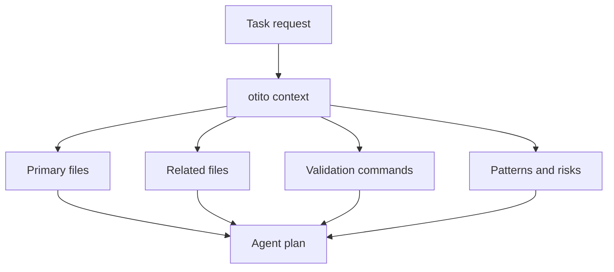

# Context Foundation

otito is designed to make repository shape visible before an agent or reviewer starts changing files.

---

## Local-First Model

otito reads the checkout on the machine where it runs. It does not call an AI model and does not upload source code to a hosted service.

| Capability         | Command                                                           | Purpose                                                                                  |
| ------------------ | ----------------------------------------------------------------- | ---------------------------------------------------------------------------------------- |
| Inspect one repo   | `otito repo . --json`                                           | Read package metadata, scripts, languages, entrypoints, and git state                    |
| Build a code map   | `otito map . --json`                                            | Map source files, imports, exports, symbols, routes, and domains (multi-domain since v1.2) |
| Generate context   | `otito context "add a new MCP tool" --path .`                   | Create task-aware file and validation guidance (vendor-filtered, data-access-boosted)    |
| Create a harness   | `otito harness . --out .otito/harness.md`                 | Prepare setup, validation, runtime, and context commands                                 |
| Review a diff      | `otito pr . --base origin/main --out .otito/pr-review.md` | Produce changed-file, risk, and review prompts                                           |
| Data-access surface| `otito data-access . --json` (v1.1+)                            | Detect inline SQL and Prisma ORM calls, grouped by source / operation / table / file     |
| Token-savings eval | `otito eval . --json` (v1.1+)                                   | Compare otito output tokens against a deterministic naive-agent approximation          |

---

## Artifact Boundaries

Generated artifacts belong under `.otito/`.

!!! info "About `.otito/`"
    Òtítọ́ writes local working artifacts under `.otito/` so reports, indexes, and evidence stay clearly separated from source files.

The directory is ignored by git and excluded from formatting/linting, so agents can write durable context without polluting source history.

---

## Context Packet Flow

---

## Operating Rules

- Use `otito repo` or `otito context` before broad or unfamiliar changes.
- Prefer JSON output when another tool or agent will consume the result.
- Prefer Markdown output when a human needs a durable context packet.
- Keep generated context under `.otito/`.
- Treat otito output as a map, then confirm important code paths by reading source files.
