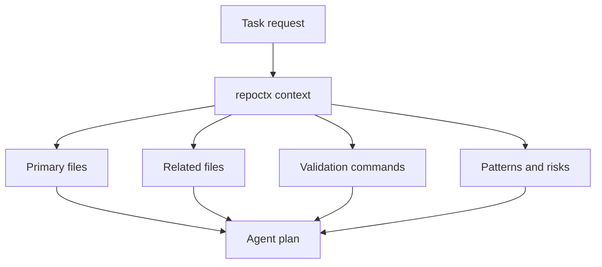

# Context Foundation

repoctx is designed to make repository shape visible before an agent or reviewer starts changing files.

---

## Local-First Model

repoctx reads the checkout on the machine where it runs. It does not call an AI model and does not upload source code to a hosted service.

| Capability         | Command                                                           | Purpose                                                                                  |
| ------------------ | ----------------------------------------------------------------- | ---------------------------------------------------------------------------------------- |
| Inspect one repo   | `repoctx repo . --json`                                           | Read package metadata, scripts, languages, entrypoints, and git state                    |
| Build a code map   | `repoctx map . --json`                                            | Map source files, imports, exports, symbols, routes, and domains (multi-domain since v1.2) |
| Generate context   | `repoctx context "add a new MCP tool" --path .`                   | Create task-aware file and validation guidance (vendor-filtered, data-access-boosted)    |
| Create a harness   | `repoctx harness . --out .dev-context/harness.md`                 | Prepare setup, validation, runtime, and context commands                                 |
| Review a diff      | `repoctx pr . --base origin/main --out .dev-context/pr-review.md` | Produce changed-file, risk, and review prompts                                           |
| Data-access surface| `repoctx data-access . --json` (v1.1+)                            | Detect inline SQL and Prisma ORM calls, grouped by source / operation / table / file     |
| Token-savings eval | `repoctx eval . --json` (v1.1+)                                   | Compare repoctx output tokens against a deterministic naive-agent approximation          |

---

## Artifact Boundaries

Generated artifacts belong under `.dev-context/`.

!!! info "Why `.dev-context/` stays"
    The product name is `repoctx`, but the artifact directory remains `.dev-context/` for backwards compatibility and because those reports are intentionally local working files.

The directory is ignored by git and excluded from formatting/linting, so agents can write durable context without polluting source history.

---

## Context Packet Flow

---

## Operating Rules

- Use `repoctx repo` or `repoctx context` before broad or unfamiliar changes.
- Prefer JSON output when another tool or agent will consume the result.
- Prefer Markdown output when a human needs a durable context packet.
- Keep generated context under `.dev-context/`.
- Treat repoctx output as a map, then confirm important code paths by reading source files.
