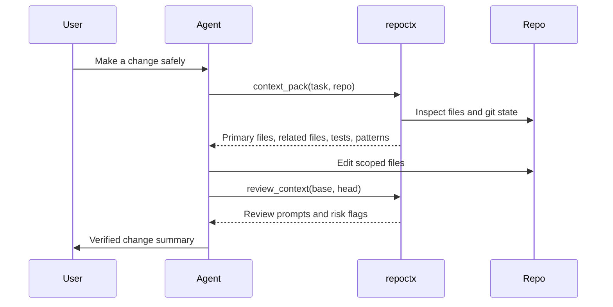

# MCP and Agent Workflows

repoctx can run as a stdio MCP server so agent hosts can ask for repository context without scraping terminal output.

---

## Start The Server

Install the CLI first:

```bash
npm install -g @nugehs/repoctx
repoctx doctor
```

Or run via `npx` without installing — recommended for MCP host configs:

```bash
npx -y @nugehs/repoctx mcp
```

```bash
repoctx mcp
```

From a local checkout:

```bash
node src/cli.js mcp
```

The MCP server uses stdio. The agent host starts `repoctx mcp` as a child process and speaks JSON-RPC over standard input and output.

---

## MCP Client Examples

Use the installed binary when possible. If a host cannot find `repoctx`, replace `"repoctx"` with the full path from `command -v repoctx` on macOS/Linux or `where repoctx` on Windows.

### Generic stdio client

Many MCP clients use this shape:

```json
{
  "mcpServers": {
    "repoctx": {
      "command": "repoctx",
      "args": ["mcp"],
      "env": {}
    }
  }
}
```

Some hosts also require an explicit `"type": "stdio"` field. Check the host's current MCP schema before copying a config into a shared repository.

For a local checkout instead of a global install:

```json
{
  "mcpServers": {
    "repoctx": {
      "command": "node",
      "args": ["/path/to/repoctx/src/cli.js", "mcp"],
      "env": {}
    }
  }
}
```

Keep `/path/to/repoctx` as a private local path. Do not commit machine-specific absolute paths to public documentation or shared repositories.

### Claude Desktop

Claude Desktop uses `claude_desktop_config.json` with a top-level `mcpServers` object.

| OS | Config file |
| --- | --- |
| macOS | `~/Library/Application Support/Claude/claude_desktop_config.json` |
| Windows | `%APPDATA%\Claude\claude_desktop_config.json` |

```json
{
  "mcpServers": {
    "repoctx": {
      "type": "stdio",
      "command": "repoctx",
      "args": ["mcp"],
      "env": {}
    }
  }
}
```

After editing the config, fully restart Claude Desktop. If the server does not appear, run `repoctx doctor` and `repoctx mcp` manually in a terminal first, then check the MCP logs for the host.

Reference: [Model Context Protocol local server guide](https://modelcontextprotocol.io/docs/develop/connect-local-servers).

### VS Code

VS Code stores MCP server configuration in `mcp.json`. Workspace-level configuration lives at `.vscode/mcp.json`; user-level configuration is also supported by VS Code.

VS Code uses a top-level `servers` object:

```json
{
  "servers": {
    "repoctx": {
      "type": "stdio",
      "command": "repoctx",
      "args": ["mcp"]
    }
  }
}
```

Useful commands from the Command Palette:

- `MCP: Add Server`
- `MCP: List Servers`
- `MCP: Reset Cached Tools`
- `MCP: Open Workspace Folder MCP Configuration`
- `MCP: Open User Configuration`

Reference: [VS Code MCP configuration reference](https://code.visualstudio.com/docs/copilot/reference/mcp-configuration).

### Cursor

Cursor uses `mcp.json` with a top-level `mcpServers` object.

| Scope | Config file |
| --- | --- |
| Project | `.cursor/mcp.json` |
| Global | `~/.cursor/mcp.json` |

```json
{
  "mcpServers": {
    "repoctx": {
      "command": "repoctx",
      "args": ["mcp"],
      "env": {}
    }
  }
}
```

Use a project config when repoctx should only be available for one workspace. Use a global config only when you want the server available across projects.

Reference: [Cursor MCP docs](https://docs.cursor.com/context/mcp).

---

## MCP Tool Surface

repoctx 2.3 exposes **13** canonical MCP tools. Legacy names (`pr_review`, `merge_readiness`, `find_*`, etc.) still work via `tools/call` until v3.0 — see [Migration to 2.0](../MIGRATION-2.0.md).

| Tool               | Purpose                                                                               |
| ------------------ | ------------------------------------------------------------------------------------- |
| `repo_inspect`     | Inspect repository shape, scripts, package managers, entrypoints, and git state       |
| `repo_map`         | Build a compact JSON code map with optional domain, kind, and route filters (TS/JS, Go, C#, Python, Java, Ruby, Rust) |
| `repo_index`       | Generate local `.dev-context/index.json` files and catalog entries; `dryRun:true` discovers read-only |
| `repo_search`      | Search cataloged repositories by path, route, import, export, symbol, or domain; omit `query` to list the catalog |
| `context_pack`     | Build a task-aware context packet                                                     |
| `change_impact`    | Rank files most likely to own a plain-English change request                          |
| `agent_experience` | Score Agent Experience (AX 0–100): changeability, containment, guardrails, clarity (v2.3+) |
| `convergence_score`| Score intent vs. execution (0–100) with a recomputable receipt (v2.3+)                |
| `review_context`   | Diff/comment review context (no verdict)                                              |
| `review_gate`      | PASS/WARN/FAIL merge gate — local without `pr`, GitHub PR gate with `pr`              |
| `review_verdict`   | Composite verdict: impact + review_context + review_gate                              |
| `workspace_report` | Build product-level context across multiple repos                                     |
| `repo_harness`     | Generate setup, validation, runtime, and context commands                             |

---

## Agent Loop



---

## Host Guidance

!!! success "Recommended agent behavior"
    Ask repoctx for context before planning broad work. Use the output to choose files to read, not as a replacement for source inspection.

!!! warning "Boundary"
    repoctx does not approve or merge code. Pair it with tests, code review, branch protection, and PullPass.

!!! warning "MCP safety"
    MCP hosts can start local processes. Only add MCP servers from trusted repositories, review command paths before enabling them, avoid putting secrets directly in config files, and keep local absolute paths out of public docs.
