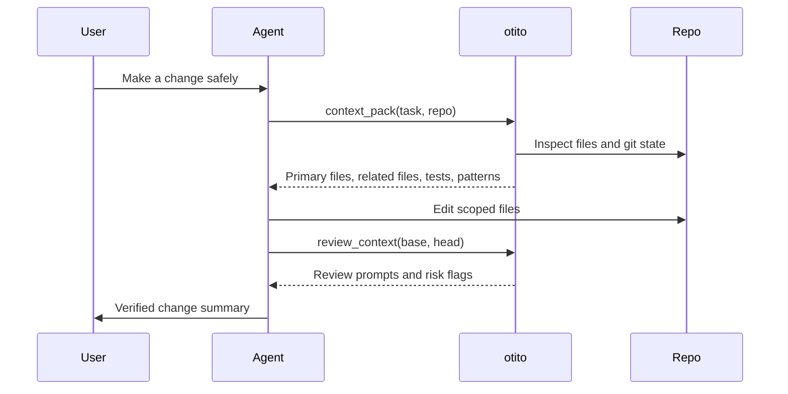

# MCP and Agent Workflows

otito can run as a stdio MCP server so agent hosts can ask for repository context without scraping terminal output.

---

## Start The Server

Install the published package when you want Otito available as a local command:

```bash
npm install -g @bashbop/otito
otito doctor
```

Or start from a local checkout:

```bash
git clone https://github.com/BASHBOP/otito.git
cd otito && npm ci
node src/cli.js doctor
```

```bash
node src/cli.js mcp
```

From a local checkout:

```bash
node src/cli.js mcp
```

The MCP server uses stdio. The agent host starts `otito mcp` as a child process and speaks JSON-RPC over standard input and output.

---

## MCP Client Examples

Use the installed `otito` binary where available. A local checkout is equally
valid when you are developing Otito itself.

### Generic stdio client

Many MCP clients use this shape:

```json
{
  "mcpServers": {
    "otito": {
      "command": "node",
      "args": ["/absolute/path/to/otito/src/cli.js", "mcp"],
      "env": {}
    }
  }
}
```

Some hosts also require an explicit `"type": "stdio"` field. Check the host's current MCP schema before copying a config into a shared repository.

For a local checkout instead of a global install:

```json
{
  "mcpServers": {
    "otito": {
      "command": "node",
      "args": ["/path/to/otito/src/cli.js", "mcp"],
      "env": {}
    }
  }
}
```

Keep `/path/to/otito` as a private local path. Do not commit machine-specific absolute paths to public documentation or shared repositories.

### Claude Desktop

Claude Desktop uses `claude_desktop_config.json` with a top-level `mcpServers` object.

| OS | Config file |
| --- | --- |
| macOS | `~/Library/Application Support/Claude/claude_desktop_config.json` |
| Windows | `%APPDATA%\Claude\claude_desktop_config.json` |

```json
{
  "mcpServers": {
    "otito": {
      "type": "stdio",
      "command": "otito",
      "args": ["mcp"],
      "env": {}
    }
  }
}
```

After editing the config, fully restart Claude Desktop. If the server does not appear, run `otito doctor` and `otito mcp` manually in a terminal first, then check the MCP logs for the host.

Reference: [Model Context Protocol local server guide](https://modelcontextprotocol.io/docs/develop/connect-local-servers).

### VS Code

VS Code stores MCP server configuration in `mcp.json`. Workspace-level configuration lives at `.vscode/mcp.json`; user-level configuration is also supported by VS Code.

VS Code uses a top-level `servers` object:

```json
{
  "servers": {
    "otito": {
      "type": "stdio",
      "command": "otito",
      "args": ["mcp"]
    }
  }
}
```

Useful commands from the Command Palette:

- `MCP: Add Server`
- `MCP: List Servers`
- `MCP: Reset Cached Tools`
- `MCP: Open Workspace Folder MCP Configuration`
- `MCP: Open User Configuration`

Reference: [VS Code MCP configuration reference](https://code.visualstudio.com/docs/copilot/reference/mcp-configuration).

### Cursor

Cursor uses `mcp.json` with a top-level `mcpServers` object.

| Scope | Config file |
| --- | --- |
| Project | `.cursor/mcp.json` |
| Global | `~/.cursor/mcp.json` |

```json
{
  "mcpServers": {
    "otito": {
      "command": "otito",
      "args": ["mcp"],
      "env": {}
    }
  }
}
```

Use a project config when otito should only be available for one workspace. Use a global config only when you want the server available across projects.

Reference: [Cursor MCP docs](https://docs.cursor.com/context/mcp).

### Gemini CLI

Gemini CLI supports stdio MCP servers. Add Otito to user-level
`~/.gemini/settings.json` or project-level `.gemini/settings.json`:

```json
{
  "mcpServers": {
    "otito": {
      "command": "otito",
      "args": ["mcp"]
    }
  }
}
```

Restart Gemini CLI and run `gemini mcp list` (or `/mcp list`) to confirm the
server is connected. Gemini CLI also supports Skills, so use the Otito trusted
agent workflow before asking it to edit code.

Reference: [Gemini CLI MCP servers](https://github.com/google-gemini/gemini-cli/blob/main/docs/tools/mcp-server.md).

### Kimi Code CLI

Kimi Code CLI supports stdio MCP servers. Add Otito to the user-level
`~/.kimi-code/mcp.json` or project-level `.kimi-code/mcp.json` file:

```json
{
  "mcpServers": {
    "otito": {
      "command": "otito",
      "args": ["mcp"]
    }
  }
}
```

Verify the server with `kimi mcp list`. Kimi Code also recognises local skills;
keep the agent workflow in the repository so it remains portable across tools.

Reference: [Kimi Code CLI MCP support](https://www.kimi.com/code/docs/en/kimi-code-cli/configuration/data-locations.html).

### Grok

Grok custom MCP connectors use a publicly reachable MCP endpoint. Otito's
local `otito mcp` command is stdio-only, so it must **not** be exposed through
a local tunnel by default. Until Otito offers a reviewed remote MCP deployment,
use the structured-handoff path instead:

```bash
otito context "<task>" --path . --out .otito/context-pack.md
otito pr . --base origin/main --out .otito/pr-review.md
```

Share only a sanitised summary or approved artifact with Grok. A future remote
connector must receive a separate security, access-control, and data-boundary
review before it can be presented as direct support.

Reference: [Grok custom MCP connectors](https://docs.x.ai/grok/connectors).

---

## MCP Tool Surface

Òtítọ́ exposes **13** MCP tools for deterministic repository context and merge evidence.

| Tool               | Purpose                                                                               |
| ------------------ | ------------------------------------------------------------------------------------- |
| `repo_inspect`     | Inspect repository shape, scripts, package managers, entrypoints, and git state       |
| `repo_map`         | Build a compact JSON code map with optional domain, kind, and route filters (TS/JS, Go, C#, Python, Java, Ruby, Rust) |
| `repo_index`       | Generate local `.otito/index.json` files and catalog entries; `dryRun:true` discovers read-only |
| `repo_search`      | Search cataloged repositories by path, route, import, export, symbol, or domain; omit `query` to list the catalog |
| `context_pack`     | Build a task-aware context packet                                                     |
| `change_impact`    | Rank files most likely to own a plain-English change request                          |
| `agent_experience` | Score Agent Experience (AX 0–100): changeability, containment, guardrails, clarity (v2.3+) |
| `convergence_score`| Score intent vs. execution (0–100) with a recomputable receipt (v2.3+)                |
| `review_context`   | Diff/comment review context (no verdict)                                              |
| `review_gate`      | PASS/WARN/FAIL merge gate — local without `pr`, GitHub PR gate with `pr`; optionally enforces a convergence floor/receipt |
| `review_verdict`   | Composite verdict: impact + review_context + review_gate                              |
| `workspace_report` | Build product-level context across multiple repos                                     |
| `repo_harness`     | Generate setup, validation, runtime, and context commands                             |

---

## Agent Loop



## Trusted Agent Workflow

This workflow works across Codex, Claude, Cursor, Gemini, Kimi, and any agent
that can use local MCP or a structured handoff:

```text
Request -> context -> scoped change -> validation -> review context -> gate -> human decision
```

The host does not determine whether a change is trustworthy. Otito provides
local, deterministic evidence; tests, protected branches, and a human reviewer
provide accountability. Do not represent a passing gate as an automatic merge
approval. A workspace-level gate binds local staged evidence across repositories;
it does not establish hosted CI state, GitHub approval, or mergeability.

---

## Host Guidance

!!! success "Recommended agent behavior"
    Ask otito for context before planning broad work. Use the output to choose files to read, not as a replacement for source inspection.

!!! warning "Boundary"
    Òtítọ́ does not approve or merge code. Pair it with tests, code review, branch protection, and a human decision.

!!! warning "MCP safety"
    MCP hosts can start local processes. Only add MCP servers from trusted repositories, review command paths before enabling them, avoid putting secrets directly in config files, and keep local absolute paths out of public docs.
