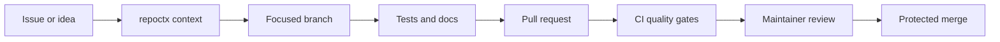

# Contributor Governance

repoctx is intended to be contributor-ready and maintainer-controlled.

---

## Contribution Flow



---

## Required Controls

| Control           | Why It Matters                                                                      |
| ----------------- | ----------------------------------------------------------------------------------- |
| PR template       | Makes scope, validation, and version impact explicit                                |
| CODEOWNERS        | Routes sensitive code paths to maintainers                                          |
| CI quality gates  | Keeps formatting, linting, typing, tests, coverage, audit, and smoke checks visible |
| Security policy   | Gives contributors a private path for vulnerability reports                         |
| SemVer guidance   | Keeps user-facing changes tied to release discipline                                |
| Branch protection | Prevents unreviewed or failing changes from reaching `main`                         |

---

## Local Gate

Run the full gate before requesting review:

```bash
npm run ci
```

The gate includes:

- formatting check
- lint
- TypeScript compiler parsing for JavaScript modules
- unit tests
- coverage thresholds
- production dependency audit
- smoke harness

---

## Review Rule

!!! success "Merge rule"
    All code changes should go through a pull request, receive maintainer/code-owner review, pass required checks, and resolve conversations before merge.

!!! warning "Solo-maintainer exception"
    If an urgent solo-maintainer fix cannot wait, leave a clear PR note explaining the risk, validation run, and why the change could not wait.
