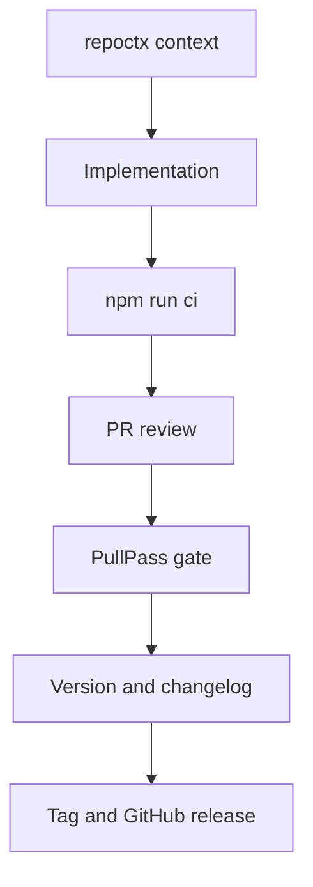

# Release Readiness

repoctx follows Semantic Versioning and keeps releases tied to tests, changelog discipline, and maintainer review.

---

## Version Impact

| Impact | Examples                                                                                    |
| ------ | ------------------------------------------------------------------------------------------- |
| None   | Docs-only changes, tests, generated fixtures, CI-only adjustments                           |
| Patch  | Bug fixes, docs corrections, dependency maintenance, low-risk internal improvements         |
| Minor  | New commands, new MCP tools, new report fields, backward-compatible behavior                |
| Major  | Removed commands, renamed fields, incompatible output changes, changed runtime requirements |

---

## Release Gate

Before tagging a release:

```bash
npm run ci
npm run version:check
```

Maintainers should keep these aligned:

- `package.json`
- `package-lock.json`
- `CHANGELOG.md`
- Git tag
- GitHub release notes

---

## Current Install Path

```bash
npm install -g github:nugehs/repoctx
repoctx doctor
```

The package also exposes the legacy alias:

```bash
dev-context doctor
```

---

## Trust-Layer Release Flow


