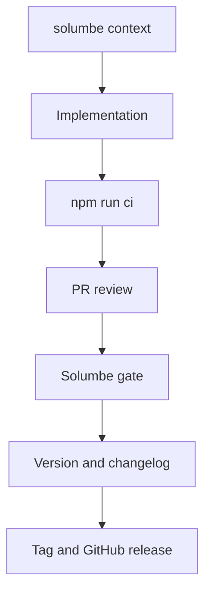

# Release Readiness

solumbe follows Semantic Versioning and keeps releases tied to tests, changelog discipline, and maintainer review.

---

## Version Impact

| Impact | Examples                                                                                    |
| ------ | ------------------------------------------------------------------------------------------- |
| None   | Docs-only changes, tests, generated fixtures, CI-only adjustments                           |
| Patch  | Bug fixes, docs corrections, dependency maintenance, low-risk internal improvements         |
| Minor  | New commands, new MCP tools, new report fields, backward-compatible behavior                |
| Major  | Removed commands, renamed fields, incompatible output changes, changed runtime requirements |

---

## Release Gate

Before merging a release into `main`:

```bash
npm run ci
npm run version:check
```

Maintainers should keep these aligned:

- `package.json`
- `package-lock.json`
- `CHANGELOG.md`
- Git tag
- GitHub release notes

The Git tag follows from `package.json`. Once `solumbe CI` passes on the release commit on `main`, the `Tag release` workflow pushes `vX.Y.Z` and starts the `Release` workflow. It refuses a version that is not newer than the latest tag or that `CHANGELOG.md` has no section for.

---

## Solumbe PR Readiness

Solumbe runs merge-readiness checks on pull requests so evidence is visible before an owner or reviewer merges.

For a solo-maintainer repository, run:

```bash
solumbe gate --pr "$PR_NUMBER" --path . --governance solo
```

Solo governance keeps one-person maintainer work moving while making missing separate review or CODEOWNERS approval explicit `WARN` evidence. The owner/admin decision still has to be recorded before merge.

For a company or shared-team repository, switch the same workflow to:

```bash
solumbe gate --pr "$PR_NUMBER" --path . --governance team --policy company
```

Then require the Solumbe readiness check alongside CI, docs build, required review, CODEOWNERS approval, and conversation resolution.

---

## Current Install Path

```bash
git clone https://github.com/BASHBOP/solumbe.git
cd solumbe && npm ci && node src/cli.js doctor
```

---

## Trust-Layer Release Flow


```mermaid
flowchart TD
    A[solumbe context] --> B[Implementation]
    B --> C[npm run ci]
    C --> D[PR review]
    D --> E[Solumbe gate]
    E --> F[Version and changelog]
    F --> G[Tag and GitHub release]
```
