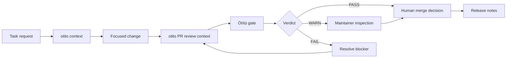

# Trust-Layer Demo

## Òtítọ́ review rhythm

This walkthrough shows the operating model behind the tools:

```text
Òtítọ́ -> context before change
Òtítọ́ -> validation before merge
Humans   -> accountability before release
```

The goal is not to replace review. The goal is to make review easier to trust.

---

## Demo Scenario

!!! example "Maintainer question"
    A contributor opens a pull request. Before anyone merges it, the team needs to know what changed, which files are risky, which tests matter, whether review is complete, and whether branch protection is doing its job.

| Role | Responsibility |
| --- | --- |
| Contributor | Opens a focused PR with tests or a no-test rationale |
| Agent | Uses otito to understand scope before suggesting changes |
| Maintainer | Reviews the PR context, risk areas, and test evidence |
| Òtítọ́ merge gate | Checks merge readiness, review state, CODEOWNERS, CI, conversations, and branch protection |

!!! note "Solo now, company-ready later"
    A solo maintainer can use the same rhythm by recording owner decisions when an admin merge is needed. As the repo is shared with companies, that owner decision becomes a team review path with CODEOWNERS, required approvals, resolved conversations, and release evidence.

---

## Walkthrough

### 1. Build context before touching code

```bash
otito context "ship the change" --path . --json
otito harness . --out .otito/harness.md
```

Evidence to expect:

- Primary files and related files for the task
- Existing tests and validation commands
- Local conventions the agent should follow
- Repository shape, package scripts, and git state

### 2. Make the smallest focused change

Keep the PR easy to review:

- One purpose
- Clear changed files
- Tests or an explicit no-test rationale
- No unrelated cleanup

### 3. Generate PR review context

```bash
otito pr . --base origin/main --out .otito/pr-review.md
```

Evidence to expect:

- Changed domains
- Risk flags
- Review prompts
- Suggested verification
- Optional GitHub PR comment when a PR number is provided

### 4. Run the merge-safety gate

```bash
otito gate .
otito gate --pr 123 --path . --json
```

Evidence to expect:

- Review decision
- CODEOWNERS coverage
- Team owner verification where GitHub access allows it
- Unresolved review conversations
- Branch protection status
- Status checks and mergeability

### 5. Keep the human decision explicit

The Òtítọ́ merge gate can report `PASS`, `WARN`, or `FAIL`, but the maintainer still owns the merge decision.

| Verdict | Meaning |
| --- | --- |
| `PASS` | The automated gate found no blocking or warning signals |
| `WARN` | A maintainer should inspect a non-blocking risk |
| `FAIL` | The PR should not merge until the blocking signal is resolved |

### 6. Post-merge attestation (audit layer)

After merge, bind the review verdict to the merge commit as tamper-evident evidence:

```bash
otito review . --pr 123 --json > verdict.json
node audit-pilot/attest.mjs --verdict verdict.json --merge <sha> --prev <base> \
     --pr 123 --author "Name" --committed <iso>
node audit-pilot/attest.mjs --verify
```

See [audit-pilot/README.md](https://github.com/BASHBOP/otito/blob/main/audit-pilot/README.md) for the hash-chained ledger pilot and production notes.

---

## Proof Checklist

Use this checklist when publishing a demo, release note, or case study.

- otito context or harness artifact exists
- PR review context exists
- CI result is visible
- Òtítọ́ merge-gate report is attached or summarized
- Required human review is recorded
- CODEOWNERS approval is present when required
- Branch protection is enabled on the base branch
- Release notes or changelog entry explain what shipped
- Solo-maintainer admin merges, if used, are recorded as explicit owner decisions
- Public evidence uses sanitized links or repo-relative paths, not local absolute paths or sensitive output

!!! note "Builder-founder operating loop"
    See the [builder-founder operating loop](../06-builder-founder-operating-loop/README.md) for the session rhythm that keeps context, focused changes, visible gates, human decisions, and durable evidence moving together.

---

## Flow



---

## Demo Script

Use this short version in a README, video, or issue comment:

```bash
otito context "describe the change" --path . --json
otito pr . --base origin/main --out .otito/pr-review.md
otito gate --pr 123 --path .
```

The public story is simple: context first, validation second, human accountability always.
