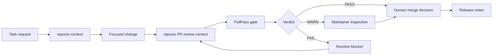

# Trust-Layer Demo

## repoctx + PullPass review rhythm

This walkthrough shows the operating model behind the tools:

```text
repoctx  -> context before change
PullPass -> validation before merge
Humans   -> accountability before release
```

The goal is not to replace review. The goal is to make review easier to trust.

---

## Demo Scenario

!!! example "Maintainer question"
    A contributor opens a pull request. Before anyone merges it, the team needs to know what changed, which files are risky, which tests matter, whether review is complete, and whether branch protection is doing its job.

| Role | Responsibility |
| --- | --- |
| Contributor | Opens a focused PR with tests or a no-test rationale |
| Agent | Uses repoctx to understand scope before suggesting changes |
| Maintainer | Reviews the PR context, risk areas, and test evidence |
| PullPass | Checks merge readiness, review state, CODEOWNERS, CI, conversations, and branch protection |

!!! note "Solo now, company-ready later"
    A solo maintainer can use the same rhythm by recording owner decisions when an admin merge is needed. As the repo is shared with companies, that owner decision becomes a team review path with CODEOWNERS, required approvals, resolved conversations, and release evidence.

---

## Walkthrough

### 1. Build context before touching code

```bash
repoctx context "ship the change" --path . --json
repoctx harness . --out .dev-context/harness.md
```

Evidence to expect:

- Primary files and related files for the task
- Existing tests and validation commands
- Local conventions the agent should follow
- Repository shape, package scripts, and git state

### 2. Make the smallest focused change

Keep the PR easy to review:

- One purpose
- Clear changed files
- Tests or an explicit no-test rationale
- No unrelated cleanup

### 3. Generate PR review context

```bash
repoctx pr . --base origin/main --out .dev-context/pr-review.md
```

Evidence to expect:

- Changed domains
- Risk flags
- Review prompts
- Suggested verification
- Optional GitHub PR comment when a PR number is provided

### 4. Run the merge-safety gate

```bash
pullpass pr
pullpass pr 123 --json
```

Evidence to expect:

- Review decision
- CODEOWNERS coverage
- Team owner verification where GitHub access allows it
- Unresolved review conversations
- Branch protection status
- Status checks and mergeability

### 5. Keep the human decision explicit

PullPass can report `PASS`, `WARN`, or `FAIL`, but the maintainer still owns the merge decision.

| Verdict | Meaning |
| --- | --- |
| `PASS` | The automated gate found no blocking or warning signals |
| `WARN` | A maintainer should inspect a non-blocking risk |
| `FAIL` | The PR should not merge until the blocking signal is resolved |

---

## Proof Checklist

Use this checklist when publishing a demo, release note, or case study.

- repoctx context or harness artifact exists
- PR review context exists
- CI result is visible
- PullPass report is attached or summarized
- Required human review is recorded
- CODEOWNERS approval is present when required
- Branch protection is enabled on the base branch
- Release notes or changelog entry explain what shipped
- Solo-maintainer admin merges, if used, are recorded as explicit owner decisions
- Public evidence uses sanitized links or repo-relative paths, not local absolute paths or sensitive output

!!! tip "Dated proof run"
    See the [2026-05-28 trust-layer proof run](./proof-run-2026-05-28.md) for a concrete terminal-capture record covering repoctx context, PullPass release discipline, CI, solo-maintainer merge visibility, and release publication.

!!! success "Company-facing case study"
    See the [company adoption case study](./company-adoption-case-study.md) for a screenshot-style walkthrough that frames repoctx and PullPass for engineering leaders, platform teams, and AI governance reviewers.

!!! quote "Company demo packet"
    See the [company demo packet](./company-demo-packet.md) for the short sendable version that ties the executive summary, proof run, case study, launch note, and pilot checklist together.

!!! example "Company pilot runbook"
    See the [company pilot runbook](./company-pilot-runbook.md) for the step-by-step first repository and PR pilot, including roles, preflight checks, evidence capture, stop conditions, and post-pilot triage.

!!! info "Proof index"
    See the [proof index](./proof-index.md) for the sanitized public evidence map and the private/internal evidence boundary.

!!! question "Company pilot feedback"
    See the [company pilot feedback loop](./company-pilot-feedback.md) for the structured intake that turns reviewer concerns into docs, repoctx improvements, PullPass gates, proof artifacts, or pilot follow-up.

!!! abstract "Public launch note"
    See the [2026-05-28 public launch note](./public-launch-note-2026-05-28.md) for the short public story: what is released, what is review-gated, why it matters, and how teams can try the trust-layer workflow.

---

## Flow



---

## Demo Script

Use this short version in a README, video, or issue comment:

```bash
repoctx context "describe the change" --path . --json
repoctx pr . --base origin/main --out .dev-context/pr-review.md
pullpass pr 123
```

The public story is simple: context first, validation second, human accountability always.
