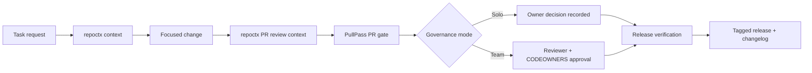

# Company Adoption Case Study

## repoctx + PullPass for AI-assisted engineering teams

This case study packages the public repoctx and PullPass proof into a company-facing adoption story.

The core promise is simple:

```text
repoctx  -> context before change
PullPass -> validation before merge
Humans   -> accountability before release
```

It is written for engineering leaders, platform teams, developer-experience owners, and AI governance reviewers who need AI-assisted software work to remain reviewable.

---

## Executive Snapshot

| Signal | Evidence |
| --- | --- |
| Context foundation | [`repoctx v0.3.2`](https://github.com/nugehs/repoctx/releases/tag/v0.3.2) |
| Merge-safety gate | [`PullPass v0.7.0`](https://github.com/nugehs/pullpass/releases/tag/v0.7.0) |
| Public proof run | [Trust-layer proof run](./proof-run-2026-05-28.md) |
| Live docs | [repoctx docs](https://nugehs.github.io/repoctx/) and [PullPass docs](https://nugehs.github.io/pullpass/) |
| Maintainer | Oluwasegun Olumbe |

!!! success "What this proves"
    A repository can use agents without making review invisible. repoctx gives the agent and reviewer a map before editing; PullPass checks merge readiness before release; the human decision remains explicit.

---

## The Company Problem

Companies want AI-assisted development, but they need answers before changes land:

- What files and domains did the agent touch?
- Did the change include tests or an explicit no-test rationale?
- Are review, CODEOWNERS, CI, branch protection, and conversations complete?
- Is a solo owner decision being used, or is a separate reviewer required?
- Can the release evidence be shown later during an audit, incident review, or customer security review?

The trust layer turns those questions into repeatable artifacts instead of ad hoc chat history.

---

## Screenshot-Style Evidence

<div class="evidence-grid" markdown>

<div class="evidence-shot" markdown>
<div class="evidence-title">repoctx PR Context</div>

```text
Changed files: 16
Risk: low (0)

cmd/pullpass/main_test.go          test
internal/githubpr/evaluate_test.go test

Suggested Verification:
- go test ./...
```

<span class="signal-pass">PASS</span> Go test files are visible to reviewers.
</div>

<div class="evidence-shot" markdown>
<div class="evidence-title">PullPass Team Mode</div>

```text
Verdict: FAIL

FAIL Review decision
FAIL CODEOWNERS
PASS Status checks
PASS Branch protection
```

<span class="signal-fail">FAIL</span> Company mode blocks missing human review.
</div>

<div class="evidence-shot" markdown>
<div class="evidence-title">PullPass Solo Mode</div>

```text
Verdict: WARN

WARN Owner/admin decision required
WARN CODEOWNERS approval missing
PASS Hard blockers
```

<span class="signal-warn">WARN</span> Solo maintainer decisions are explicit.
</div>

<div class="evidence-shot" markdown>
<div class="evidence-title">Release Evidence</div>

```text
npm run ci                         PASS
mkdocs build --strict              PASS
repoctx doctor                     PASS
PullPass release discipline        PASS
repoctx v0.3.2                     PUBLISHED
```

<span class="signal-pass">PASS</span> Release notes are tied to verification.
</div>

</div>

---

## Operating Model



This model gives a solo founder and a company team the same workflow shape. The approval bar changes as risk and team size grow.

---

## Governance Modes

| Mode | Intended Use | Merge Rule |
| --- | --- | --- |
| Solo maintainer | Founder or single owner repo | Admin decision is allowed, but must be recorded with CI and PullPass evidence |
| Small team | Early engineering team | Require one human reviewer and CODEOWNERS for sensitive paths |
| Company team | Shared product repository | Require CODEOWNERS, status checks, resolved conversations, and release evidence |
| High-risk team | Auth, payments, data, deployment, regulated workflows | Add stricter policy profiles, owner groups, incident review, and audit retention |

PullPass `team` mode keeps missing review and CODEOWNERS approval as `FAIL`. PullPass `solo` mode reports those same gaps as explicit owner-decision `WARN` signals so the maintainer does not confuse an admin merge with a reviewed merge.

---

## Pilot Plan

| Week | Outcome | Evidence |
| --- | --- | --- |
| 1 | Install repoctx and PullPass on one repository | `repoctx doctor`, `repoctx harness`, PullPass local report |
| 2 | Add PR context to normal review flow | `.dev-context/pr-review.md` or GitHub PR comment |
| 3 | Turn on branch protection and CODEOWNERS | Required checks, required review, CODEOWNERS coverage |
| 4 | Publish a dated proof run | Linked PRs, CI results, PullPass output, release notes |

!!! info "Pilot scope"
    Start with one non-critical repo and one real PR. The goal is to prove the rhythm, not to boil the engineering ocean in week one.

---

## Decision Record Template

Use this in PR descriptions, merge comments, or release notes:

```text
Trust-layer decision

Context:
- repoctx context generated:
- repoctx PR review generated:
- PullPass mode:
- PullPass verdict:
- CI result:

Human decision:
- Owner/reviewer:
- Decision:
- Rationale:

Release evidence:
- Version:
- Changelog:
- Verification:
```

---

## Definition of Done

For company adoption, a PR is ready when:

- repoctx context exists before or during review
- PullPass has been run in the correct governance mode
- CI and required status checks are green
- CODEOWNERS and reviewer requirements match the repo policy
- unresolved conversations are closed
- release metadata and changelog are updated when versioned behavior changes
- the human decision is visible

This is the product story: context first, validation second, human accountability always.
