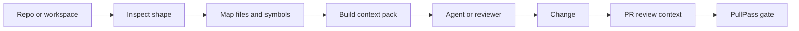

# :material-source-branch: Òtítọ́

## Local repo intelligence for agents and reviewers

**Prepared by:** Oluwasegun Olumbe<br>
**Status:** v1.0.0 — clean Òtítọ́ product cutover, ready for Bashbop publication<br>
**Category:** Practical AI governance for developers

> A Bashbop Ltd product for teams that want context before code changes, review prompts before merge, and less guessing in agent workflows.

---

!!! info "About Òtítọ́"
    Òtítọ́ is a local-first context system. It inspects repositories, builds code maps, creates task-aware context packs, prepares PR review harnesses, and exposes the same workflow through an MCP server.

    Its command-line and package identity is `otito`.

    :material-animation-play: See the [**How It Works** visual walkthrough](assets/otito-how-it-works.html) — a layered diagram of the discover → index → context → gate flow.

---

## :material-sparkles: What's New

!!! tip "v1.0.0 — Òtítọ́ clean cutover (2026-07-29)"
    - Install with **`npm install -g @bashbop/otito`**.
    - Run the deterministic CLI with **`otito`**.
    - Configure MCP with **`npx -y @bashbop/otito mcp`**.

See [CHANGELOG.md](https://github.com/BASHBOP/otito/blob/main/CHANGELOG.md) for the full history.

---

## :material-file-document-multiple: Documentation Pack

| # | Document | Description | Status |
| :-: | --- | --- | :-: |
| 01 | [:material-map-marker-path: Context Foundation](./01-context-foundation/README.md) | Repository inspection, maps, search, context packs, and harnesses | :material-check-circle: Active |
| 02 | [:material-lan-connect: MCP and Agents](./02-mcp-agent-workflows/README.md) | MCP tools and agent-facing workflows | :material-check-circle: Active |
| 03 | Bashbop stewardship | Protected review, release discipline, and CODEOWNERS | :material-check-circle: Active |
| 04 | [:material-tag-check: Release Readiness](./04-release-readiness/README.md) | SemVer, changelog discipline, CI, and release gates | :material-check-circle: Active |
| 05 | [:material-play-circle: Trust-Layer Demo](./05-trust-layer-demo/README.md) | otito plus PullPass as a repeatable review workflow | :material-check-circle: Active |
| 06 | [:material-repeat: Builder-Founder Loop](./06-builder-founder-operating-loop/README.md) | Session rhythm, evidence ledger, governance ladder, and next-action rule | :material-check-circle: Active |

---

## :material-check-decagram: What otito Provides

!!! success "Current Capabilities"
    - Repository inspection with languages, scripts, entrypoints, and git state
    - AST-backed JSON-first code maps for TypeScript, JavaScript, Go, C#, Python, Java, Ruby, and Rust
    - Multi-domain file tagging so feature subdirs surface under both root and feature names
    - Local discovery, indexing, catalog search, and workspace reports
    - Task-aware context packs before agents plan or edit, with vendor-bundle filtering
    - Data-access surface reports (inline SQL and Prisma) with per-file boosts in context-pack scoring
    - Local-vs-naïve eval suite for measuring otito's token savings
    - PR review context from git diffs and optional GitHub comments
    - Go test-file detection for PullPass-style repositories
    - MCP tools for repository context, search, maps, and review workflows
    - Contributor-ready governance: CI, CODEOWNERS, templates, security, and release guidance

---

## :material-graph: Context Flow



---

## Quick Start

=== "Install"

    ```bash
    npm install -g @bashbop/otito
    otito doctor
    ```

=== "Local Checkout"

    ```bash
    npm ci
    npm run ci
    node src/cli.js doctor
    ```

=== "MCP"

    ```bash
    otito mcp
    ```

---

<div class="grid cards" markdown>

-   :material-map:{ .lg .middle } **Context Before Change**

    ---

    Generate the map an agent or reviewer needs before touching the code.

-   :material-magnify-scan:{ .lg .middle } **Search Across Local Repos**

    ---

    Discover, index, catalog, and search local repositories without sending code to a hosted model.

-   :material-source-pull:{ .lg .middle } **PR Review Harness**

    ---

    Turn diffs into review prompts, risk flags, changed domains, and test hints.

-   :material-shield-check:{ .lg .middle } **Governance Ready**

    ---

    Pair otito with PullPass for a repeatable trust layer: context before change, validation before merge.

-   :material-play-circle:{ .lg .middle } **Public Demo Path**

    ---

    Show the workflow end to end: context pack, focused change, PR review context, PullPass gate, human merge.

-   :material-briefcase-check:{ .lg .middle } **Company Adoption Case Study**

    ---

    Package the trust layer for engineering leaders, platform teams, and AI governance reviewers.

-   :material-repeat:{ .lg .middle } **Builder-Founder Operating Loop**

    ---

    Keep every coding-agent session tied to context, focused change, visible gates, human decisions, and durable evidence.

</div>
