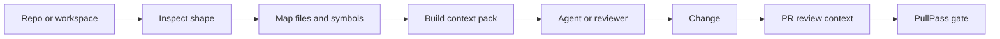

# :material-source-branch: repoctx

## Local repo intelligence for agents and reviewers

**Prepared by:** Oluwasegun Olumbe<br>
**Status:** v0.3.2 Go-aware PR context<br>
**Category:** Practical AI governance for developers

> Built and maintained by **Oluwasegun Olumbe** for teams that want context before code changes, review prompts before merge, and less guessing in agent workflows.

---

!!! info "About repoctx"
    repoctx is a local-first context system. It inspects repositories, builds code maps, creates task-aware context packs, prepares PR review harnesses, and exposes the same workflow through an MCP server.

    It keeps the legacy `dev-context` command as an alias while making `repoctx` the canonical product name.

---

## :material-file-document-multiple: Documentation Pack

| # | Document | Description | Status |
| :-: | --- | --- | :-: |
| 01 | [:material-map-marker-path: Context Foundation](./01-context-foundation/README.md) | Repository inspection, maps, search, context packs, and harnesses | :material-check-circle: Active |
| 02 | [:material-lan-connect: MCP and Agents](./02-mcp-agent-workflows/README.md) | MCP tools and agent-facing workflows | :material-check-circle: Active |
| 03 | [:material-account-check: Contributor Governance](./03-contributor-governance/README.md) | Reviews, branch protection, CODEOWNERS, and contributor flow | :material-check-circle: Active |
| 04 | [:material-tag-check: Release Readiness](./04-release-readiness/README.md) | SemVer, changelog discipline, CI, and release gates | :material-check-circle: Active |
| 05 | [:material-play-circle: Trust-Layer Demo](./05-trust-layer-demo/README.md) | repoctx plus PullPass as a repeatable review workflow | :material-check-circle: Active |

---

## :material-check-decagram: What repoctx Provides

!!! success "Current Capabilities"
    - Repository inspection with languages, scripts, entrypoints, and git state
    - AST-backed JSON-first code maps for JavaScript, TypeScript, and Go projects
    - Local discovery, indexing, catalog search, and workspace reports
    - Task-aware context packs before agents plan or edit
    - PR review context from git diffs and optional GitHub comments
    - Go test-file detection for PullPass-style repositories
    - MCP tools for repository context, search, maps, and review workflows
    - Contributor-ready governance: CI, CODEOWNERS, templates, security, and release guidance

---

## :material-graph: Context Flow



---

## Quick Start

=== "Install"

    ```bash
    npm install -g github:nugehs/repoctx
    repoctx doctor
    ```

=== "Local Checkout"

    ```bash
    npm ci
    npm run ci
    node src/cli.js doctor
    ```

=== "MCP"

    ```bash
    repoctx mcp
    ```

---

<div class="grid cards" markdown>

-   :material-map:{ .lg .middle } **Context Before Change**

    ---

    Generate the map an agent or reviewer needs before touching the code.

-   :material-magnify-scan:{ .lg .middle } **Search Across Local Repos**

    ---

    Discover, index, catalog, and search local repositories without sending code to a hosted model.

-   :material-source-pull:{ .lg .middle } **PR Review Harness**

    ---

    Turn diffs into review prompts, risk flags, changed domains, and test hints.

-   :material-shield-check:{ .lg .middle } **Governance Ready**

    ---

    Pair repoctx with PullPass for a repeatable trust layer: context before change, validation before merge.

-   :material-play-circle:{ .lg .middle } **Public Demo Path**

    ---

    Show the workflow end to end: context pack, focused change, PR review context, PullPass gate, human merge.

</div>
