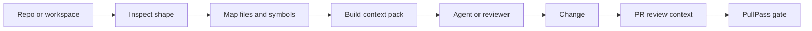

# :material-source-branch: repoctx

## Local repo intelligence for agents and reviewers

**Prepared by:** Oluwasegun Olumbe<br>
**Status:** v1.3.1 — npm and MCP manifest versions are aligned; documentation and MCP surface are current with the v1.1/v1.2 capability set; ships `eval`, `data-access`, multi-domain code maps, and the v1.0 absorption (`impact`, `pass`, `pass-pr`, `review`)<br>
**Category:** Practical AI governance for developers

> Built and maintained by **Oluwasegun Olumbe** for teams that want context before code changes, review prompts before merge, and less guessing in agent workflows.

---

!!! info "About repoctx"
    repoctx is a local-first context system. It inspects repositories, builds code maps, creates task-aware context packs, prepares PR review harnesses, and exposes the same workflow through an MCP server.

    It keeps the legacy `dev-context` command as an alias while making `repoctx` the canonical product name.

---

## :material-sparkles: What's New

!!! tip "v1.3.1 — release-readiness cleanup (2026-06-02)"
    npm package metadata, `package-lock.json`, MCP registry manifest versions, and public docs are aligned. The operating loop now treats `repoctx impact` as the canonical analyzer after absorbing the standalone `impact-map` work.

!!! tip "v1.3.0 — docs and MCP surface alignment (2026-06-02)"
    Documentation reflects the current `repoctx eval`, `repoctx data-access`, multi-language code maps, multi-domain tagging, and MCP tool surface, including `find_backend_route` and `find_frontend_api_client`.

!!! tip "v1.2.0 — multi-domain discoverability (2026-06-01)"
    Files in feature subdirs are now tagged under both their root domain *and* the feature name. `components/livestream/RecordingsPanel.tsx` matches both `find_domain('components')` and `find_domain('livestream')`. File records gain a `domains: string[]` field; `find_domain`, `filterFiles`, `findFrontendApiClient`, and `context_pack` scoring all read from the full set. Cache version bumped 3 → 4; existing `.dev-context/index.json` caches will rebuild on next access.

!!! tip "v1.1.0 — eval, data-access, and five new languages (2026-05-30)"
    - **`repoctx eval`** runs a fixed task suite (`repo_overview`, `code_map`, `harness`, `context_pack`) on any target repo and reports tokens of repoctx output vs a deterministic naive-agent approximation. `--json` output is CI-friendly for regression gating.
    - **`repoctx data-access`** detects inline SQL strings (any language) and Prisma ORM calls; aggregates by source, operation, table, and file. New `dataAccess` field on file records; `context_pack` scoring boosts files that touch the DB by up to +15.
    - **C#, Python, Java, Ruby, Rust** code-map extractors join the existing TS/JS/Go support.
    - **Vendor-bundle filter** drops `*.min.js`, `Bootstrap.js`, `jquery.js`, etc. from `context_pack` scoring so they no longer surface as primary files.

See [CHANGELOG.md](https://github.com/nugehs/repoctx/blob/main/CHANGELOG.md) for the full history.

---

## :material-file-document-multiple: Documentation Pack

| # | Document | Description | Status |
| :-: | --- | --- | :-: |
| 01 | [:material-map-marker-path: Context Foundation](./01-context-foundation/README.md) | Repository inspection, maps, search, context packs, and harnesses | :material-check-circle: Active |
| 02 | [:material-lan-connect: MCP and Agents](./02-mcp-agent-workflows/README.md) | MCP tools and agent-facing workflows | :material-check-circle: Active |
| 03 | [:material-account-check: Contributor Governance](./03-contributor-governance/README.md) | Reviews, branch protection, CODEOWNERS, and contributor flow | :material-check-circle: Active |
| 04 | [:material-tag-check: Release Readiness](./04-release-readiness/README.md) | SemVer, changelog discipline, CI, and release gates | :material-check-circle: Active |
| 05 | [:material-play-circle: Trust-Layer Demo](./05-trust-layer-demo/README.md) | repoctx plus PullPass as a repeatable review workflow | :material-check-circle: Active |
| 06 | [:material-repeat: Builder-Founder Loop](./06-builder-founder-operating-loop/README.md) | Session rhythm, evidence ledger, governance ladder, and next-action rule | :material-check-circle: Active |

---

## :material-check-decagram: What repoctx Provides

!!! success "Current Capabilities"
    - Repository inspection with languages, scripts, entrypoints, and git state
    - AST-backed JSON-first code maps for TypeScript, JavaScript, Go, C#, Python, Java, Ruby, and Rust
    - Multi-domain file tagging so feature subdirs surface under both root and feature names
    - Local discovery, indexing, catalog search, and workspace reports
    - Task-aware context packs before agents plan or edit, with vendor-bundle filtering
    - Data-access surface reports (inline SQL and Prisma) with per-file boosts in context-pack scoring
    - Local-vs-naïve eval suite for measuring repoctx's token savings
    - PR review context from git diffs and optional GitHub comments
    - Go test-file detection for PullPass-style repositories
    - MCP tools for repository context, search, maps, and review workflows
    - Contributor-ready governance: CI, CODEOWNERS, templates, security, and release guidance

---

## :material-graph: Context Flow



---

## Quick Start

=== "Install"

    ```bash
    npm install -g @nugehs/repoctx
    repoctx doctor
    ```

=== "Local Checkout"

    ```bash
    npm ci
    npm run ci
    node src/cli.js doctor
    ```

=== "MCP"

    ```bash
    repoctx mcp
    ```

---

<div class="grid cards" markdown>

-   :material-map:{ .lg .middle } **Context Before Change**

    ---

    Generate the map an agent or reviewer needs before touching the code.

-   :material-magnify-scan:{ .lg .middle } **Search Across Local Repos**

    ---

    Discover, index, catalog, and search local repositories without sending code to a hosted model.

-   :material-source-pull:{ .lg .middle } **PR Review Harness**

    ---

    Turn diffs into review prompts, risk flags, changed domains, and test hints.

-   :material-shield-check:{ .lg .middle } **Governance Ready**

    ---

    Pair repoctx with PullPass for a repeatable trust layer: context before change, validation before merge.

-   :material-play-circle:{ .lg .middle } **Public Demo Path**

    ---

    Show the workflow end to end: context pack, focused change, PR review context, PullPass gate, human merge.

-   :material-briefcase-check:{ .lg .middle } **Company Adoption Case Study**

    ---

    Package the trust layer for engineering leaders, platform teams, and AI governance reviewers.

-   :material-repeat:{ .lg .middle } **Builder-Founder Operating Loop**

    ---

    Keep every coding-agent session tied to context, focused change, visible gates, human decisions, and durable evidence.

</div>
