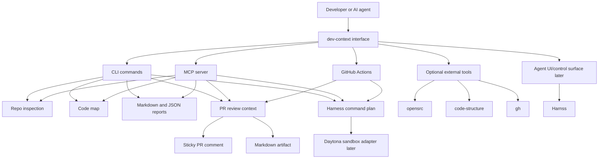
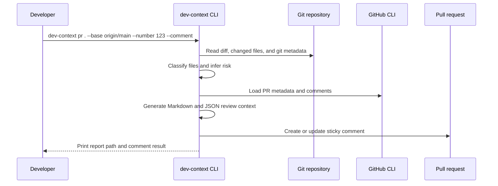

# Building Useful Developer Context Tools With Codex

This guide is a YouTube-ready teaching plan for building a practical developer tool like `dev-context`: a wrapper CLI plus MCP server that helps agents and developers understand repositories, generate reports, review PRs, and connect to existing tools.

The goal is not to build a flashy demo. The goal is to teach a repeatable process viewers can use to arrive at a working tool.

## Audience

This content is for developers who:

- use AI coding tools but want better repo context
- have multiple internal tools they want to combine
- want to build a CLI, MCP server, or GitHub PR automation
- understand basic JavaScript or TypeScript
- are comfortable with Git and terminal commands

## Final Outcome

By the end, viewers should have a tool that can:

- inspect a repo and return useful JSON
- generate Markdown reports
- create a code map for agents
- wrap optional tools like `opensrc` and `code-structure`
- explain where `harness`, Daytona, Harnss, MCP, and GitHub Actions fit
- run as an MCP server
- generate PR review context
- post a sticky GitHub PR comment
- run in GitHub Actions
- scaffold the workflow into another repo with `init`

## Core Teaching Principle

Build wrappers first. Replace tools later only when the wrapper proves where the real pain is.

This matters because many developers start by rebuilding everything. That usually wastes time. A wrapper lets you:

- ship faster
- compare tools honestly
- keep JSON contracts stable
- dogfood on real repos
- expose the same capability through CLI, MCP, and CI

## Tool Roles And How They Work

Use this section early in the tutorial so viewers understand the tool stack before any code is written.

The important distinction:

- `dev-context harness` is a generated context artifact and command plan.
- Harnss is a separate desktop agent UI/control surface.
- Daytona is a separate sandbox execution platform.

`dev-context` should be the stable orchestration layer between these pieces. It should not become a sandbox, a desktop UI, or a full coding agent.

| Tool or concept | What it does | How `dev-context` uses it | Build phase |
|---|---|---|---|
| `dev-context` | Local CLI and MCP server for repo context | Owns repo inspection, code maps, reports, PR context, harness generation, and stable JSON output | Core product |
| `dev-context harness` | Produces setup, validation, runtime, and context commands for a repo | Reads package managers, scripts, git metadata, and code-map facts, then emits Markdown/JSON with token estimates | Core product |
| Greploop | Problem pattern, not a required dependency | Frames the repeated search/read/retry loop that wastes agent context | Episode 1 framing |
| `opensrc` | Resolves package source code for dependencies | `dev-context deps` calls `opensrc path <package>`, then searches the resolved source path | Current optional wrapper |
| `code-structure` | Generates HTML structure views for TypeScript/JavaScript files | `dev-context structure` runs the tool globally or through `npx`, then writes an artifact | Current optional wrapper |
| `gh` | Reads PR metadata and posts GitHub comments | `dev-context pr --number <n> --comment` enriches reports and updates a sticky PR comment | Current optional wrapper |
| MCP | Lets agent hosts call repo tools directly | `dev-context mcp` exposes repo inspection, code map, harness, workspace, and PR tools over stdio JSON-RPC | Core interface |
| Daytona | Runs code inside isolated sandboxes | Future adapter should create a sandbox, copy or clone the repo, run the generated harness commands, and return logs/artifacts | Phase 2 |
| Harnss | Desktop UI for running and observing coding agents | Future integration should display `dev-context` outputs and tool calls in an agent control surface | Future UI reference |
| GitHub Actions | Runs context generation in team workflow | Generated workflows run PR reports, upload artifacts, and optionally comment on PRs | CI automation |

### Wrapper Flow

The teaching loop should be:

```text
repo -> inspect -> map -> harness -> report -> MCP/CI -> optional external execution
```

In practical terms:

1. `repo` discovers the project shape.
2. `map` creates an agent-readable code map.
3. `harness` turns repo facts into commands an agent or CI job can safely run.
4. `deps` and `structure` call optional external tools only when those tools add value.
5. `mcp` and GitHub Actions expose the same contracts to agents and team workflows.
6. Daytona can later execute the harness in isolation.
7. Harnss can later make agent runs and tool calls easier to observe.

### Commands To Show

```bash
node src/cli.js matrix
node src/cli.js doctor --json
node src/cli.js repo . --json
node src/cli.js map . --json
node src/cli.js harness . --out .dev-context/harness.md
node src/cli.js deps zod --query parse
node src/cli.js structure . --pattern "src/**/*.js" --out .dev-context/structure.html
```

When explaining the output, keep repeating the boundary:

```text
dev-context gathers context and produces stable commands.
Other tools execute, visualize, or enrich specific parts of that workflow.
```

Reference links for the tool discussion:

- Daytona sandboxes: https://www.daytona.io/docs/en/sandboxes/
- Daytona CLI: https://www.daytona.io/docs/tools/cli/
- opensrc: https://opensrc.sh/
- code-structure: https://npm.io/package/code-structure
- Harnss: https://github.com/OpenSource03/harnss

## Visual Overview

Use this diagram near the start of the video to explain the product shape.



Use this diagram when explaining the series roadmap.

```mermaid
flowchart LR
  Start["Problem framing"] --> CLI["CLI skeleton"]
  CLI --> Inspect["Repo inspection"]
  Inspect --> Reports["Reports"]
  Reports --> Wrappers["Wrap existing tools"]
  Wrappers --> CodeMap["Code maps"]
  CodeMap --> Workspace["Workspace reports"]
  Workspace --> MCP["MCP server"]
  MCP --> PR["PR review workflow"]
  PR --> Actions["GitHub Actions"]
  Actions --> Init["Init scaffolding"]
  Init --> Package["Package and share"]
```



Use this diagram when teaching the PR review workflow.



## Recommended Series Flow

### Episode 1: The Problem

Working title:

> Stop Asking AI to Guess Your Codebase

Objective:

Explain the problem clearly before coding.

Key points:

- AI agents fail when they lack repo context.
- Existing tools solve pieces of the problem.
- The missing layer is orchestration.
- Tool choice should be explicit: wrap what works, own the stable contract, defer sandboxes and UIs until they are needed.
- The first version should be boring, inspectable, and useful.

Demo setup:

```bash
mkdir dev-context
cd dev-context
git init
npm init -y
```

Prompt to use:

```text
I want to build a developer-context CLI that wraps existing tools instead of replacing them.

The tool should help developers and AI agents inspect repos, generate reports, understand code structure, review PRs, and eventually expose MCP tools.

Help me design the first useful MVP. Keep it dependency-light. Prioritize commands that can be tested locally.
```

Expected output:

- CLI command list
- MVP scope
- clear decision to wrap first

Quality gate:

You should be able to explain the tool in one sentence:

```text
dev-context gives developers and agents one stable interface for repo inspection, code maps, reports, PR context, and MCP access.
```

### Episode 2: Build The First CLI

Working title:

> Building a Zero-Dependency Node CLI for Repo Context

Objective:

Create a basic CLI with commands:

- `help`
- `doctor`
- `repo`
- `matrix`
- `report`

Prompt:

```text
Implement a dependency-free Node ESM CLI.

Commands:
- help: print usage
- doctor: check availability of node, git, gh, opensrc, code-structure
- repo <path>: inspect repo files, languages, package managers, scripts, entrypoints, and git info
- matrix: print a tool evaluation matrix
- report <path>: generate a Markdown and JSON developer report

Use small modules under src/lib.
Add node:test tests for argument parsing and repo inspection.
```

Commands to demo:

```bash
node src/cli.js help
node src/cli.js doctor
node src/cli.js repo . --json
node src/cli.js matrix
node src/cli.js report . --out .dev-context/report.md
```

Quality gates:

```bash
npm test
node src/cli.js repo . --json
node src/cli.js matrix
node src/cli.js report . --out .dev-context/report.md
```

Teaching note:

The important design decision is stable JSON output. Markdown is for humans. JSON is for agents and automation.

The `matrix` command should not just list tools. It should explain boundaries:

- `opensrc` and `code-structure` are wrappers to implement now.
- Daytona is for later isolated execution.
- Harnss is for later agent UI inspiration.
- `dev-context harness` is the bridge that makes future execution predictable.

### Episode 3: Wrap Existing Tools

Working title:

> Do Not Rebuild Everything: Wrap Useful Tools First

Objective:

Add wrappers for:

- `opensrc` for dependency source lookup
- `code-structure` for TypeScript structure HTML

Prompt:

```text
Add two wrapper commands to the CLI.

1. deps <package> [--query text] [--limit n] [--json]
   - use opensrc path <package>
   - if opensrc is missing, return a clear install hint
   - if query is provided, search matching lines in the dependency source

2. structure <path> [--pattern glob] [--exclude file] [--out file] [--json]
   - run code-structure
   - if code-structure is missing but npx exists, try npx --yes code-structure
   - write output to .dev-context when requested

Keep failures readable.
Add tests around command behavior where possible.
```

Commands to demo:

```bash
npm install -g opensrc code-structure

node src/cli.js deps zod --query parse
node src/cli.js structure . --pattern "src/**/*.js" --out .dev-context/structure.html
```

Quality gates:

- Missing tools produce install hints.
- Present tools produce artifacts.
- Failure output is useful, not a stack trace.

Teaching note:

External tools are allowed to fail. Your wrapper should fail clearly.

Do not build Daytona or Harnss adapters in this episode. Those are bigger integration surfaces:

- Daytona needs sandbox credentials, lifecycle rules, repo transfer, command execution, log capture, and cleanup.
- Harnss is a control surface for watching and managing agents, not a command-line dependency for the MVP.

The correct bridge is the harness artifact. Once `dev-context harness` can reliably say how to set up, validate, run, and inspect a repo, a sandbox or UI can consume that plan later.

### Episode 4: Build Code Maps

Working title:

> Give AI a Code Map Before You Ask It to Edit

Objective:

Build `map <path>` that classifies files and extracts useful symbols.

Prompt:

```text
Add a code-map command.

It should scan TypeScript and JavaScript files and return JSON with:
- repo summary
- file kind: route, apiRoute, controller, service, module, component, hook, apiClient, dto, schema, test, source
- inferred domain
- Next.js route path when applicable
- Nest controller base path and HTTP methods when applicable
- imports
- exports
- simple symbol list with line numbers

Also add Markdown formatting for humans.
Add tests using small Next.js and NestJS fixture files.
```

Commands to demo:

```bash
node src/cli.js map . --json
node src/cli.js map . --out .dev-context/code-map.md
```

Quality gates:

- Classifies real frontend files.
- Classifies real backend files.
- Returns useful domain names.
- Does not require a full TypeScript parser for the MVP.

Teaching note:

Regex-based extraction is acceptable for the MVP if the contract is honest. You can replace it with AST parsing later if the value is proven.

### Episode 5: Multi-Repo Workspace Reports

Working title:

> Teaching AI a Product, Not Just One Repo

Objective:

Build `workspace <repo...>` for related repos such as frontend and API.

Prompt:

```text
Add a workspace command that accepts two or more repo paths.

It should aggregate:
- repo summaries
- languages
- package managers
- key scripts
- code-map summaries
- shared domains
- likely frontend/backend integration domains

Return Markdown by default and JSON with --json.
```

Commands to demo:

```bash
node src/cli.js workspace /path/to/web /path/to/api --out .dev-context/workspace.md
node src/cli.js workspace /path/to/web /path/to/api --json
```

Quality gates:

- Works on two real repos.
- Identifies shared domains.
- Produces a report a new developer can read in five minutes.

Teaching note:

This is where the tool becomes more than a file scanner. It starts explaining product structure.

### Episode 6: Add MCP

Working title:

> Turn Your CLI Into an MCP Server

Objective:

Expose CLI capabilities as MCP tools.

Tools to expose:

- `repo_inspect`
- `repo_map`
- `workspace_report`
- `find_domain`
- `find_file_kind`
- `find_backend_route`
- `find_frontend_api_client`

Prompt:

```text
Add a dependency-free stdio MCP server to this CLI.

Command:
- mcp

Implement JSON-RPC over stdio with:
- initialize
- ping
- tools/list
- tools/call

Expose tools for repo inspection, repo map, workspace report, finding files by domain, finding files by kind, finding backend routes, and finding frontend API clients.

Return both text content and structuredContent for tool calls.
Add a node:test test that spawns the MCP server, initializes it, lists tools, and calls repo_inspect.
```

Manual MCP test:

```bash
printf '%s\n' \
  '{"jsonrpc":"2.0","id":1,"method":"initialize","params":{"protocolVersion":"2025-06-18","capabilities":{},"clientInfo":{"name":"manual","version":"0"}}}' \
  '{"jsonrpc":"2.0","id":2,"method":"tools/list","params":{}}' \
  '{"jsonrpc":"2.0","id":3,"method":"tools/call","params":{"name":"repo_inspect","arguments":{"path":"."}}}' \
| node src/cli.js mcp
```

Codex custom MCP setup:

```text
Name:
dev-context

Command:
/opt/homebrew/bin/node

Arguments:
/absolute/path/to/dev-context/src/cli.js
mcp

Working directory:
/absolute/path/to/dev-context
```

Optional environment variable:

```text
PATH=/opt/homebrew/bin:/usr/local/bin:/usr/bin:/bin:/usr/sbin:/sbin
```

Quality gates:

- MCP host can list tools.
- Tool calls return structured content.
- A real repo can be inspected through MCP.

Teaching note:

The CLI remains the source of truth. MCP is another interface over the same implementation.

### Episode 7: PR Review Workflow

Working title:

> Build a PR Review Bot That Actually Has Context

Objective:

Build `pr <path>` that generates review context from Git diff, code map, risk flags, and optional GitHub comments.

Prompt:

```text
Add a PR review command.

Command:
pr <path> [--base ref] [--head ref] [--number n] [--github] [--comment] [--out file] [--json]

It should:
- inspect git diff from base to head
- include working tree fallback
- include untracked files
- classify changed files using the code map
- summarize changed domains
- infer risk flags
- suggest verification commands from package scripts
- optionally enrich from gh pr view
- optionally create or update a sticky GitHub PR comment

Keep comment posting non-fatal.
Add tests with a temporary git fixture and fake gh executable.
```

Commands to demo:

```bash
node src/cli.js pr . --base origin/main --out .dev-context/pr-review.md
node src/cli.js pr . --number 123 --comment
```

Quality gates:

- Clean repo reports no changed files.
- Working tree changes are included.
- Untracked files are included.
- Config-only changes do not suggest noisy TypeScript tests.
- Comment creation is tested with fake `gh`.

Teaching note:

The PR report should help reviewers decide where to look first. It should not pretend to be a complete automated review.

### Episode 8: GitHub Actions

Working title:

> Put Your Dev Tool Into the Team Workflow

Objective:

Run the PR review automatically on GitHub.

Prompt:

```text
Add a GitHub Actions workflow.

File:
.github/workflows/dev-context-pr.yml

It should:
- run on pull_request opened, synchronize, reopened, ready_for_review
- checkout the PR head with full history
- set up Node
- fetch the base branch
- run node src/cli.js pr . with --base, --head, --number, --out, and --comment
- upload .dev-context/pr-review.md as an artifact

Use the built-in github.token.
Set permissions for contents read, issues write, and pull-requests read.
```

Workflow command:

```bash
node src/cli.js pr . \
  --base "origin/${{ github.base_ref }}" \
  --head HEAD \
  --number "${{ github.event.pull_request.number }}" \
  --out .dev-context/pr-review.md \
  --comment
```

Quality gates:

- Workflow is committed.
- PR report artifact uploads.
- Sticky comment updates instead of duplicating.
- If comment permissions fail, report generation still succeeds.

Teaching note:

This is the point where the tool becomes team infrastructure.

### Episode 9: Init Scaffolding

Working title:

> Make Your Tool Easy To Install In Another Repo

Objective:

Add `init <path>` so another repo can get the `.dev-context` folder and GitHub Actions workflow without manual copying.

Prompt:

```text
Add an init command.

Command:
init <path> [--tool-repo owner/repo] [--tool-ref ref] [--force] [--no-workflow] [--json]

It should:
- create .dev-context/README.md
- create .github/workflows/dev-context-pr.yml
- avoid overwriting existing files unless --force is passed
- generate a target-repo workflow that checks out the dev-context tool repo into .dev-context/tool
- run on pull_request and push events
- on pull_request, generate the report and update the sticky PR comment
- on push, generate and upload the artifact without commenting

Add tests using a temporary directory.
```

Commands to demo:

```bash
node src/cli.js init /path/to/target-repo
node src/cli.js init /path/to/target-repo --force
```

Quality gates:

- Existing workflows are not overwritten by default.
- `--force` overwrites generated files.
- The generated workflow uses `.dev-context/tool/src/cli.js`.
- Push events do not try to post PR comments.

### Optional Episode 10: Daytona Sandbox Adapter

Working title:

> Run The Harness In A Clean Sandbox

Objective:

Show how a future Daytona adapter would execute the same harness commands outside the developer's machine.

Do not start here. Build this only after `repo`, `map`, `harness`, `pr`, and MCP have stable JSON contracts.

Adapter shape:

```text
dev-context harness . --json
        |
        v
create Daytona sandbox
        |
        v
clone or upload repo
        |
        v
run setup commands
        |
        v
run validation commands
        |
        v
collect logs, artifacts, status
```

Prompt:

```text
Design a Daytona adapter for dev-context.

Input:
- repo path or git URL
- harness JSON from dev-context
- optional timeout and cleanup policy

Behavior:
- create an isolated sandbox
- copy or clone the repo
- run harness setup commands
- run harness validation commands
- stream logs
- return JSON with command status, stdout/stderr summaries, artifact paths, and cleanup result

Keep Daytona optional. If credentials or CLI/SDK are missing, return a clear install/configuration hint.
Do not make ordinary repo inspection depend on Daytona.
```

Commands to demo once implemented:

```bash
node src/cli.js harness . --json
node src/cli.js sandbox . --provider daytona --json
```

Quality gates:

- Missing Daytona configuration produces a readable hint.
- Sandbox creation and cleanup are explicit.
- Failed setup or test commands return structured status.
- Local `harness` behavior still works without Daytona.

Teaching note:

Daytona is execution isolation. `dev-context` should decide what to run; Daytona should provide where to run it.

### Optional Episode 11: Harnss Or Agent UI Integration

Working title:

> Make Agent Work Visible

Objective:

Explain how an agent UI can consume `dev-context` outputs without making the CLI depend on a desktop app.

Integration shape:

```text
dev-context MCP tools
        |
        v
agent host or desktop UI
        |
        v
repo facts, code maps, harness commands, PR reports
        |
        v
visible tool calls, diffs, logs, and artifacts
```

Prompt:

```text
Design an integration between dev-context and an agent control surface like Harnss.

The CLI should remain the source of truth.
The UI should call dev-context through MCP or shell commands.

Expose:
- repo_inspect
- repo_map
- repo_harness
- pr_review
- workspace_report

The UI should display structured results, command plans, changed files, logs, and generated artifacts.
Do not move repo scanning logic into the UI.
```

Quality gates:

- The UI can list MCP tools.
- The UI can call `repo_harness`.
- Generated reports are linked as artifacts.
- The same CLI command still works in terminal and CI.

Teaching note:

Harnss is about visibility and control. `dev-context` is about context contracts.

## Prompting Pattern

Use this structure repeatedly:

```text
Goal:
Build [specific capability].

Current state:
The repo has [existing commands/modules].

Constraints:
- dependency-free unless necessary
- preserve existing CLI behavior
- return JSON for automation
- Markdown for humans
- add focused tests
- dogfood on a real repo

Implementation:
Add [files/modules].
Expose through [CLI/MCP/GitHub Action].

Verification:
Run [commands].
Fix failures before stopping.
```

## Master Prompt For Starting From Zero

```text
You are helping me build a practical developer-context tool.

I want a dependency-light Node CLI that wraps existing tools and exposes useful repo context to developers, AI agents, MCP hosts, and GitHub Actions.

Do not start by rebuilding everything.

Build in this order:
1. CLI skeleton
2. repo inspection
3. doctor command
4. Markdown and JSON reports
5. wrappers for optional external tools
6. code map
7. workspace report
8. MCP server
9. PR review workflow
10. GitHub Actions automation

For each step:
- inspect the repo first
- make the smallest useful implementation
- add tests
- run the command on a real repo
- fix failures
- keep outputs stable and readable

Start by proposing the file structure and first commands, then implement.
```

## Useful Commands For The Series

```bash
# Run tests
npm test

# Inspect this repo
node src/cli.js repo . --json

# Scaffold dev-context into another repo
node src/cli.js init /path/to/target-repo

# Generate a report
node src/cli.js report . --out .dev-context/report.md

# Generate a code map
node src/cli.js map . --out .dev-context/code-map.md

# Generate a workspace report
node src/cli.js workspace /path/to/web /path/to/api --out .dev-context/workspace.md

# Generate PR review context
node src/cli.js pr . --base origin/main --out .dev-context/pr-review.md

# Start MCP server
node src/cli.js mcp

# Check help
node src/cli.js help
```

## Minimum Repo Structure

```text
dev-context/
  package.json
  README.md
  src/
    cli.js
    lib/
      args.js
      output.js
      tools.js
      doctor.js
      repo.js
      report.js
      code-map.js
      workspace.js
      mcp.js
      pr-review.js
  tests/
    args.test.js
    repo.test.js
    report.test.js
    code-map.test.js
    workspace.test.js
    mcp.test.js
    pr-review.test.js
  .github/
    workflows/
      dev-context-pr.yml
```

## What To Show On Screen

For each episode, show the same loop:

1. State the user problem.
2. Write the prompt.
3. Inspect the generated plan.
4. Implement or let Codex implement.
5. Run tests.
6. Run the command on a real repo.
7. Fix the first failure.
8. Show the final output.
9. Commit the change.

This teaches process, not just code.

## What To Avoid

- Do not hide errors.
- Do not skip tests.
- Do not overbuild the first version.
- Do not claim AI is reviewing code if the tool only gathers context.
- Do not create MCP before the CLI contracts are stable.
- Do not make every command depend on GitHub or external services.

## Viewer Exercise Ideas

Ask viewers to extend the tool with one of these:

- add `owners` command using `git log`
- add `security-hotspots` command for auth/payment/config files
- add `route-map` command for frontend and backend routes
- add `dependency-risk` command for changed dependencies
- add `init` command that scaffolds `.dev-context` and GitHub Actions
- add package publishing with `npm publish`

## Definition Of A Useful Tool

A developer tool is useful when:

- it solves a repeated workflow
- it gives stable machine-readable output
- it gives readable human output
- it can be tested
- it can run locally
- it can run in CI
- it improves real work within one minute of use

If a viewer reaches that point, they have built something real.
